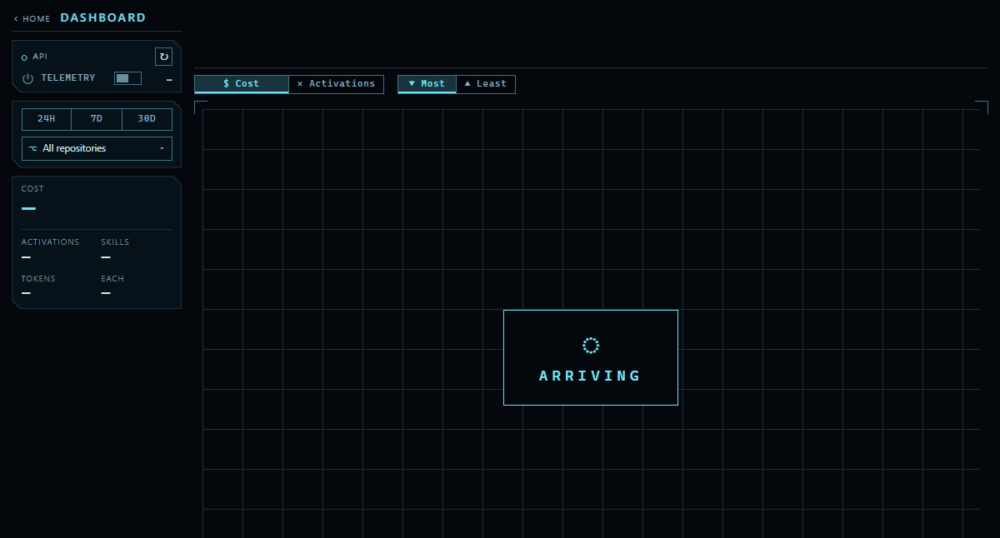
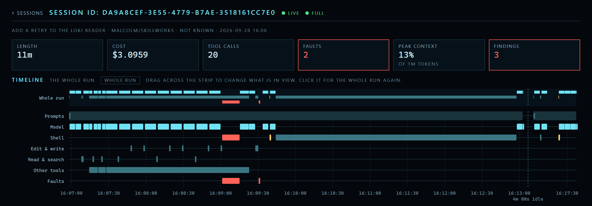

# Skillworks

Skillworks is two tools for a team that builds with Claude Code.

**Studio** is an app you run on your own machine. It reads your team's Claude Code telemetry. It
shows which skills Claude uses and what they cost, and what each Session did, step by step.

**The Plugin** is a Claude Code plugin that runs the Dev loop. You argue a design out with Claude.
Then the loop builds it, ticket by ticket, while nobody watches. It builds each ticket test-first,
reviews it three ways and runs your own checks on it before it lands.

## Studio

### The Dashboard



The Dashboard draws your skills as Tiles, sized by their Cost or by their Activations. It shows each
skill's Activations, Cost, Tokens, Models, Efforts and Repositories, for the last day, week or month.
A skill in your plugins that nobody used still shows, at zero, so you can see which skills earn their
place.

The answers arrive a day at a time, so the page is useful before the last day lands.

### Sessions



Sessions lists each run of Claude Code. Open one to see what it was given and what it did: every
Prompt, model turn and Tool call on one timeline, with its Subagents, Faults and Friction. Studio
names the Findings worth your attention, and a click takes you to the moment each one happened.

With the Plugin on, every commit Claude makes names its Session, so a commit leads back to the run
that wrote it. [Studio's telemetry](docs/studio/telemetry.md#which-session-made-a-commit) says how
to read it back.

## Run Studio

You need these on your machine:

- the .NET 10 SDK
- Node 20 or later
- the Aspire CLI
- Docker, running

Then, from the repo root:

```
aspire run
```

In Git Bash, type `aspire.cmd run`. Open the `web` resource in the Aspire dashboard it prints.

Claude Code sends nothing until telemetry is on. Turn it on with the Telemetry switch on the
Dashboard's rail, then restart any Claude Code Session that is already running. The switch records
what you type and what Claude Code answers. [Studio's telemetry](docs/studio/telemetry.md) says what
it records.

Out of the box, Studio reads the stores that `aspire run` starts, so it shows only your own machine.
Point it at your team's stores, and every developer sees the same numbers.
[Running Studio](docs/studio/running.md) has the settings.

### Try it on a seeded month

To see Studio full of data before you have any, run it on a made-up month. Docker must be running.
Run `npm install` in `src/Skillworks.Studio.Web` once first. Then, from the repo root:

```
node tools/seeded-studio.mjs
```

Open `http://localhost:5173/`. Ctrl+C stops everything.

## The Dev loop

The Dev loop has two stages, and one command starts each:

```
/skillworks:grill-with-docs      argue the design out, and publish the spec
/skillworks:spec-loop <spec#>    build it, ticket by ticket, while nobody watches
```

**The Grill.** Claude asks you about the design one question at a time, each with the answer it
recommends. It looks up facts in the code itself, so you only make decisions. Claude writes each
word and decision to your repo as soon as it settles. When no question is left, Claude sums up the
design and asks you to confirm. Your yes publishes the spec. After it, nothing asks you anything unless the
loop stops.

**The spec loop.** `/skillworks:spec-loop` cuts the spec into tickets. Then a script builds each
ticket in a worktree of its own:

1. A Session builds the change, test-first.
2. Three fresh Sessions review it, and each fixes what it finds: against your rules, against the
   spec, and for where the code sits.
3. A Session reads all three reports and fixes what is left. Then a Session cuts the comments back
   to what your rules keep.
4. The script runs your Suite, the checks that decide green for your repo. A red Suite goes back to
   the fix once. A second red stops the loop.
5. The loop commits the ticket, closes it, and lands it on your Target branch.

When the last ticket lands, a drift check reads the whole spec against what was built. The loop
builds any Gap it finds as one more ticket. Then the whole Suite runs once more. You come back to a
finished spec, or to a log that says where the loop stopped and why.

The Target branch is a branch you push to, such as `main`. Or it is a branch for each spec, and your
team reviews the spec as one pull request. The specs and tickets live in GitHub Issues, or in Markdown
files committed to your repo.

Skillworks is built this way. Its specs and tickets are its
[GitHub issues](https://github.com/MalcolmMcNeely/skillworks/issues).

### Set up the Plugin

You need `git`, `claude` and `uv` on your `PATH`, and `gh` logged in if your specs live in GitHub
Issues. Your repo needs an `origin` remote. Clone Skillworks once, anywhere on your machine:

```
git clone https://github.com/MalcolmMcNeely/skillworks.git
```

Then open Claude Code in your repo, and run:

```
/plugin marketplace add <your clone>/plugins
/plugin install skillworks@skillworks
/skillworks:skillworks-setup
```

Setup copies the Steering into your repo: the files that tell the loop about your repo, such as the
rules the reviews hold your code to and the Suite file that names your checks. Your team owns them
from then on. Run setup once per repo, and again at any time to repair it.

Lost? `/skillworks:what-next` looks at where you are and tells you which skill fits.
[Using Skillworks](docs/usage/README.md) says how each part works.

## Working on Skillworks

[Working on Skillworks](docs/CONTRIBUTING.md) has the checks and the repo layout.

## Licence

Apache 2.0. See [LICENSE](LICENSE) and [NOTICE](NOTICE).

Most skills under `plugins/skillworks/skills/` and `.claude/skills/` are vendored from other projects and stay MIT.
See [THIRD-PARTY-NOTICES.md](THIRD-PARTY-NOTICES.md) for which are ours and which are theirs.
