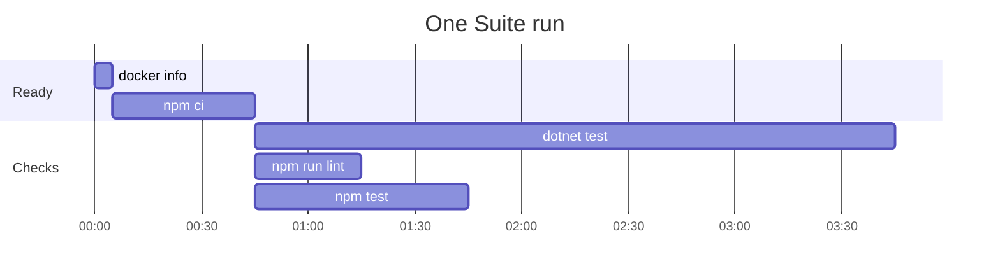

# The Suite

The Suite is the checks your repo names for the loop to run before a ticket Lands. Your team owns the
list, so your team says what green means for its own code. The loop runs the checks the Suite file
names and nothing else.

## The Suite file

The Suite file is `docs/agents/suite.json`. Setup seeds it with no checks, so a new repo starts by
adding its own:

```json
{
  "runs": 1,
  "checks": [
    {
      "command": ["dotnet", "test"],
      "folder": ".",
      "ready": {
        "command": ["docker", "info"],
        "message": "Docker does not answer. Start Docker and run this again."
      },
      "ignores": ["docs", "web"]
    },
    {
      "command": ["npm", "run", "lint"],
      "folder": "web",
      "ready": {
        "command": ["npm", "ci"],
        "message": "The front end has nothing installed, and npm ci would not install it.",
        "unless": "web/node_modules"
      }
    },
    {
      "command": ["pytest", "scripts"],
      "folder": ".",
      "image": "docs/agents/scripts.Dockerfile"
    }
  ]
}
```

## What a check holds

| Key | What it does |
|---|---|
| `command` | The program and its arguments, one word to an entry. The loop starts it with no shell. |
| `folder` | Where the command runs, from the repo root. |
| `ready` | Optional. A command that proves the machine can run the check, such as `docker info`, and the `message` the loop prints when it fails. With `unless`, a path from the repo root, the loop skips the command when the path is there, so an install is not done twice. |
| `ignores` | Optional. The paths the check cannot be changed by. See below. |
| `image` | Optional. A Dockerfile in the repo, from the repo root. The check runs in that image. See below. |

`runs`, beside `checks`, says how many times the loop runs a red Suite before it believes it. It is 1
when the file leaves it out. With `runs` at 2 or more, a check that goes red and then passes on the
same inputs is a **Flake**. A Flake counts as green, so it does not stop the loop. It is always
reported: the Suite output names each Flake after the last run, and keeps what it said when red. Set
`runs: 2` when your checks fail now and then for reasons that are not the code, such as a busy
machine or a process that crashes at random. Leave it at 1 when every red is real, because a second
run of a real red only costs time.

## Proofs: a check never proves the same thing twice

Each time a check passes, the Suite keeps a **Proof**: the check, and the exact inputs it passed on.
A check whose inputs match a Proof does not run. Its line in the Suite output says it did not run,
and names the Proof and when it was made. A Suite in which every check has a Proof passes.

A check's inputs are every file in the worktree that git does not ignore, less the check's
`ignores`. Uncommitted and untracked files count. The Suite reads each file as it is on disk. The
check's own entry in the Suite file counts too, so an edit to its `command`, `folder`, `ready`,
`ignores` or `image` runs it again.

- Only a check that passes keeps a Proof. A red check keeps none, so it runs again next time.
- Proofs stay in your clone, in its git folder. Every worktree and every loop in the clone shares
  them. Nothing pushes them, so a pass on another machine never counts here.
- A ticket pays only for the checks its change can reach. After a red Suite, only the red checks and
  the checks whose inputs the fix changed run again. A landing after a rebase runs only what is new.

## `ignores`: the paths a check cannot be changed by

A check with `ignores` lists paths from the repo root, as git pathspecs. A folder, a file and a
pattern such as `src/*.json` all work. A change to one of those paths does not run the check again.
A check without `ignores` runs again when any file changes.

Name what the check ignores, not what it reads. A path you forget to ignore costs time: the check
runs when it did not need to. It never lets a red change land. So start with no `ignores`, and add
them only to a slow check, where they save minutes.

Before you ignore a path, make sure no test reads it. A test that reads a doc is changed by that doc.

A Suite file that still gives a check `when` is turned down, and the loop stops with the Suite not
ready. `when` listed the paths that woke a check. To rewrite it, delete `when` and list under
`ignores` the paths the check cannot be changed by. Or delete `when` and add nothing: the check then
runs again on any change, which is always safe.

## `image`: a check that runs in a container

Some tests start many processes, and some OSes are slow to start one. A check with `image` names a
Dockerfile, so the check runs on an OS that is fast for it. Keep the Dockerfile in `docs/agents/`
with the rest of your Steering.

1. The loop builds the image. Docker keeps what it built before, so a second build is fast.
2. It copies the check's inputs into a new container: every file git does not ignore, less the
   check's `ignores`. Uncommitted and untracked files go in too. A file git ignores, or the check
   ignores, does not.
3. It runs the `command` in the container, from the check's `folder`. The container's output and
   exit status are the check's.
4. It removes the container, red or green.

A Session runs the tests of a check with `image` as a Trial, below, and never on the host.

The Dockerfile is one of the check's inputs, unless the check ignores it. So a new image runs the
check again.

A check with `image` needs Docker on the machine, and not its own program. If `docker info` fails,
the machine is not ready, and the loop stops as it does for a failed `ready` command.

A copy made on Windows keeps the line endings of your checkout. A shell script with CRLF endings
fails in Linux, so check out every `.sh` with LF, in `.gitattributes`:

```
*.sh text eol=lf
```

## How the loop runs the Suite

The Suite runs once for each ticket after the build, the reviews, the fix and the comment sweep.
Before the ticket Lands, it rebases onto the newest Target branch, and if the Target branch moved,
the Suite runs again on the new base. A check whose inputs a Proof holds does not run, so that
second run is usually short. No Session runs it. The driver runs it, reads the exit status itself,
and keeps the output.

1. **Ready first.** Every program a check that will run needs must be on `PATH`. Then the `ready`
   command of each check that will run runs, one by one, because two checks can share one install.
   A check with a Proof needs nothing from the machine. A machine that is not ready is not a red
   Suite. The loop stops and prints the `message`, and no Session is asked to fix it, because no
   Session can start Docker.
2. **Then the checks run together.** So a Suite takes as long as its slowest check, and not the sum
   of them all.
3. **A red check lets the others finish.** The fix step then reads every failure at once. The Suite
   is red when any check is red.
4. **The output keeps the order of the file.** Each check's output is whole, whatever finished
   first, so two runs of one Suite read the same.



The readiness commands run one after the other. The three checks start together, and the Suite
ends when `dotnet test`, the slowest, ends.

## The full run

A Proof knows only the files in the repo. A change outside the repo, such as a new SDK, can leave a
Proof stale. So after each loop run that landed at least one ticket, the driver runs the whole Suite
again on the newest Target branch from `origin`, in a new worktree. It runs once, at the end, after
the drift check. It does this when the loop stopped early too, because the tickets that landed are on
the Target branch all the same.

The full run trusts no Proof and uses no image. Every check runs, on your own machine, so the code is
proved on the OS your team uses. It keeps no Proof. A check that goes red there loses all its
Proofs, so a stale Proof cannot skip it again.

A red full run stops the loop. The report names the red checks and the tickets that landed in the
run. The spec stays open, and no Session is asked to fix it: a red Target branch is yours to
decide on.

A full run with a red or a Flake keeps its worktree, so a crash dump or a log a tool wrote there
survives for you to read. A full run with neither removes its worktree. The next full run of that
spec removes a kept worktree before it opens its own. If the kept worktree will not go, the run stops
and names its path.

## Running the Suite yourself

`skillworks-suite` is the Plugin's command for the Suite. It runs the Suite in the worktree you are
in, with Proofs, as the loop does. The Proofs it keeps count for the loop, so an agent that checks
its own work adds almost nothing to the ticket. Point your agents at it, in your `CLAUDE.md`, in
place of your raw test commands.

`skillworks-suite --fresh` is the full run, by hand. It trusts no Proof, uses no image, keeps no
Proof, and takes away the Proofs of a check that goes red. Run it when you want to prove the Target
branch yourself.

## A Trial: some of a check's tests, in its image

A **Trial** runs a command of your own in the image a check names. It is for the few tests your
change touches, when the check that runs them runs in an image:

```
skillworks-suite --image docs/agents/scripts.Dockerfile -- pytest scripts/suite_test.py -k proof
```

The form is `skillworks-suite --image <Dockerfile> -- <command>`. Name the image by the path the
Suite file gives it. Everything after `--` is the command, one word to an argument.

1. It builds the image, as the check does.
2. It copies the check's inputs into a new container, the same copy a run of the check makes.
   Untracked files go in. Paths the check ignores, and tracked files you deleted, do not. When two
   checks name the image, a path goes in unless both of them ignore it.
3. It runs the command from the folder you are in, at its place under `/repo` in the container, so a
   relative path means the same thing there. It prints what the command printed, and exits with its
   exit code. A Trial started from a folder outside the repo is refused.
4. It removes the container, however the Trial ends.

A Trial keeps no Proof, reads none and forgets none. Part of a check never stands in for the whole
check, so the Suite judges the same Proofs after a Trial as it would have judged with no Trial.

A Trial refuses an image that no check in the Suite file names. It needs Docker, and if `docker info`
fails, it stops with the Suite's own message.

## A red Suite

A red Suite on every one of its `runs` belongs to the ticket. The loop goes back to the fix step, then
the comment sweep, then the Suite, once. Red again stops the loop, and the ticket stays open.

Set `runs` above 1 only if your tests flake. A Session handed a failure it cannot reproduce may weaken
a test, or change code that was never broken. With `runs` at 2, the loop runs a red Suite a second
time before it acts. A check that passed is proved now, so the second run runs only the red checks.
Every run's output is kept in the step's record, so you can read a flake afterwards.
