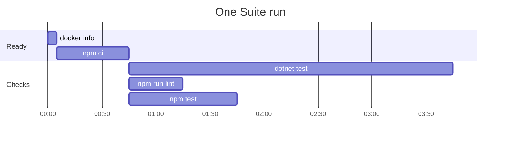

# The Suite

The Suite is the checks your repo names for the loop to run before a ticket Lands. Your team owns the
list, so your team says what green means for its own code. The loop runs the checks the Suite file
names and nothing else.

## The Suite file

The Suite file is `docs/agents/suite.json`. Setup seeds it with no checks, so a new repo starts by
adding its own:

```json
{
  "runs": 1,
  "checks": [
    {
      "command": ["dotnet", "test"],
      "folder": ".",
      "ready": {
        "command": ["docker", "info"],
        "message": "Docker does not answer. Start Docker and run this again."
      }
    },
    {
      "command": ["npm", "run", "lint"],
      "folder": "web",
      "when": ["web"],
      "ready": {
        "command": ["npm", "ci"],
        "message": "The front end has nothing installed, and npm ci would not install it.",
        "unless": "web/node_modules"
      }
    }
  ]
}
```

## What a check holds

| Key | What it does |
|---|---|
| `command` | The program and its arguments, one word to an entry. The loop starts it with no shell. |
| `folder` | Where the command runs, from the repo root. |
| `ready` | Optional. A command that proves the machine can run the check, such as `docker info`, and the `message` the loop prints when it fails. With `unless`, a path from the repo root, the loop skips the command when the path is there, so an install is not done twice. |
| `when` | Optional. The paths that wake the check. See below. |

`runs`, beside `checks`, says how many times the loop runs a red Suite before it believes it. It is 1
when the file leaves it out.

## `when`: the paths that wake a check

A check with `when` lists paths from the repo root, each a file or a folder. It runs only when the
ticket's own change touches one of them. A check without `when` runs on every ticket.

The change is every file that differs from the commit the ticket's worktree was cut from, uncommitted
and untracked files included. So a check wakes for what the ticket did, and never for what other
tickets pushed to `main` meanwhile.

- A check that did not run says so in one line of the Suite output, naming the check. A ticket's
  record shows what was not proved as well as what was.
- A change that wakes no check runs every check, and the output says why. A Suite that ran nothing
  cannot pass.
- A change the loop cannot read runs every check. Running a check that was not needed is the safe
  way to be wrong.

Name every path a check reads, not only its code. A test that reads a doc wakes for that doc too.

## How the loop runs the Suite

The Suite runs once for each ticket after the build, the reviews, the fix and the comment sweep.
Before the ticket Lands, it rebases onto the newest `main`, and if `main` moved, the Suite runs again
on the new base. No Session runs it. The driver runs it, reads the exit status itself, and keeps the output.

1. **Ready first.** Every program the file names must be on `PATH`. Then every `ready` command runs,
   one by one, because two checks can share one install. A machine that is not ready is not a red
   Suite. The loop stops and prints the `message`, and no Session is asked to fix it, because no
   Session can start Docker.
2. **Then the checks run together.** So a Suite takes as long as its slowest check, and not the sum
   of them all.
3. **A red check lets the others finish.** The fix step then reads every failure at once. The Suite
   is red when any check is red.
4. **The output keeps the order of the file.** Each check's output is whole, whatever finished
   first, so two runs of one Suite read the same.



The readiness commands run one after the other. The three checks start together, and the Suite
ends when `dotnet test`, the slowest, ends.

## A red Suite

A red Suite on every one of its `runs` belongs to the ticket. The loop goes back to the fix step, then
the comment sweep, then the Suite, once. Red again stops the loop, and the ticket stays open.

Set `runs` above 1 only if your tests flake. A Session handed a failure it cannot reproduce may weaken
a test, or change code that was never broken. With `runs` at 2, the loop runs a red Suite a second
time before it acts. A run that passes is never run again, so the cost is paid only when something
went red. Every run's output is kept in the step's record, so you can read a flake afterwards.
