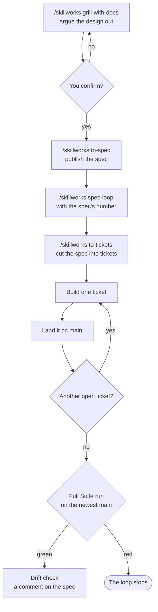
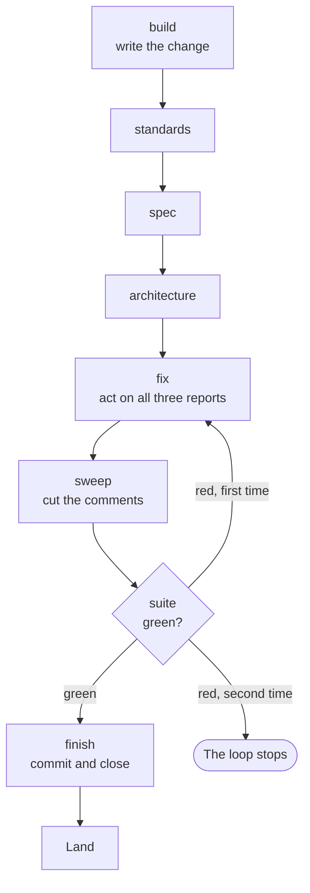
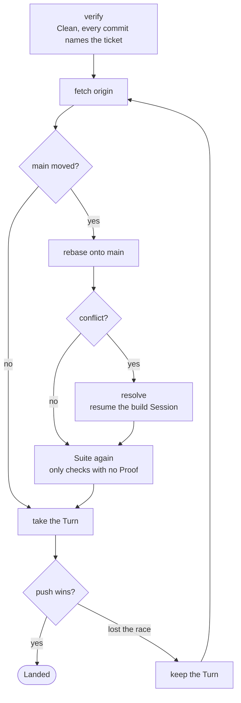
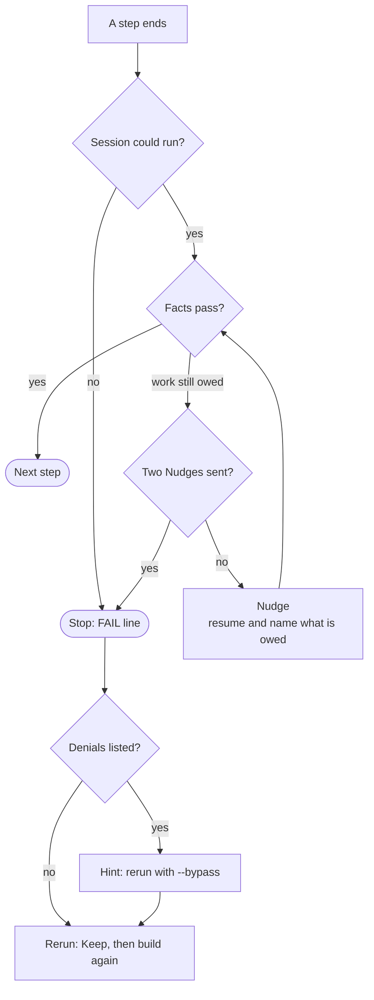

# The loop

How a design becomes code in your repo. Two stages, and one gate between them.

Stage one is an interview. You argue the design out with a Session, and the words and decisions are
written to your repo as they settle. It ends when you confirm the design.

Stage two is a script. It breaks the design into tickets and takes each one to `main` on its own, in a
worktree of its own, through a fixed run of Claude Code Sessions. Nobody watches it.



Your `yes` at the gate is the whole of your consent. Nothing between it and the drift report at the
end asks you anything, unless the loop stops.

## Stage one: settle the design

### The grill

`/skillworks:grill-with-docs` asks the questions one at a time. Each one is numbered and carries a
recommended answer. It asks only what can be answered now: a question that hangs on a decision you
have not made yet waits for that decision.

Finding facts is never your job. A question that needs a fact from the code or the Tracker goes to a
sub-agent. The decisions are yours. The lookups are not.

Your glossary, `CONTEXT.md`, and your ADRs in `docs/adr/` are edited the moment a word or a decision
settles, not at the end. Every Session after this one starts with an empty context, and can only find
those decisions in the repo.

### The gate

When no question is left, the Session sums up the problem, the design, the words and ADRs written on
the way, and what was ruled out. Then it asks you to confirm.

- On **no**, what you said becomes the next round of questions.
- On **yes**, everything after runs with nobody watching. So the summary is the thing you consent to.
  It carries every decision the spec will be built from.

### The spec

On your yes, `/skillworks:to-spec` runs. It publishes a `SPEC:` issue on GitHub with the
`ready-for-agent` label. It commits and pushes what the interview changed on disk, and it reports the
spec's number.

The push matters as much as the issue. The spec points at decisions that must already be in the repo,
because no later Session can see this one.

That number is what you give to `/skillworks:spec-loop`.

## Stage two: build it

### The tickets

`/skillworks:spec-loop <spec>` checks that the spec is open, then runs `/skillworks:to-tickets`. That
cuts the spec into tickets. Each ticket is a thin slice through every layer, small enough for one
fresh Session, and it names the tickets that must land before it. Each one is published as a
**sub-issue of the spec**. That link is what stops two people's loops from taking each other's work.

Then the skill starts the `spec-loop` script in the background, and tells you where its log is. The
script does the rest. The skill never builds a ticket itself.

Before the script starts work, it checks that `gh` is logged in, that `claude` is on `PATH`, and that
the spec is open and has tickets. It records where `origin/main` stood in `.spec-loop/<spec>/base.sha`.
That file is written once, so a restarted run still measures from where the first run began.

**Picking a ticket** is a query, not a judgement. The script takes the spec's first open sub-issue
that has no open blocker and that nobody has claimed.

**Claiming** it assigns itself, waits three seconds, and reads the assignees back. Another name there
means it lets the ticket go and moves on.

Open tickets that are all blocked or claimed by someone else stop the run with a `STUCK` line.

### Worktrees and Job branches

Each ticket is built in a worktree of its own, cut from the newest `origin/main`:

| What | Where |
|---|---|
| The worktree | `.claude/worktrees/spec-<spec>/ticket-<n>` |
| The Job branch | `spec-loop/<spec>/ticket-<n>` |

Your own checkout is never worked in. You keep it, on any branch, with any edits in it, for the whole
run. A ticket that Lands has its worktree and its Job branch removed. A ticket that stops keeps both,
so you can read what went wrong.

### The steps of one ticket

<!-- steps -->
build → standards → spec → architecture → fix → sweep → suite → finish



Every step but `suite` is a Session of its own, run inside the ticket's worktree.

| Step | What it does |
|---|---|
| `build` | Builds the change test-first, and leaves it uncommitted. |
| `standards` | Reviews the change against your rules, and fixes what it finds. |
| `spec` | Reviews the change against the ticket and the spec, and fixes what it finds. |
| `architecture` | Reviews where the change sits and which way it points, and fixes what it finds. |
| `fix` | Reads all three reports at once, settles any disagreement, and fixes what is left. |
| `sweep` | Cuts the comments back to what your rules keep. |
| `suite` | The script runs your Suite. No Session is asked. |
| `finish` | Commits the change with the ticket named in the message, and closes the ticket. It never pushes. |

The three reviews start cold. A review that resumed the build Session would mark its own work. `fix`
and `finish` resume the build Session, because they act on the code it wrote.

`sweep` comes after `fix`, because every step that writes could put back a comment the sweep cut.

The script reads a fact after each step, because a Session can end cleanly and still do nothing. It
reads the step's result, git and the ticket's state. For example, `build` must leave the worktree
changed, and `finish` must leave a new commit, a Clean worktree and a closed ticket.

**An Edit.** A review can change the code. So the script reads the worktree before and after each
review, and the difference is that review's Edit. It goes to the log as an `EDIT` line and into the
`fix` prompt beside the report. An Edit never stops the loop. It is only never silent.

### The Suite

The Suite is the checks your repo names in `docs/agents/suite.json`. The script runs them itself,
reads the exit status, and keeps the output. So the gate that says a ticket is done rests on nothing a
Session said about itself. [The Suite](suite.md) has the whole file.

Each time a check passes, the Suite keeps a **Proof**: the check, and the exact inputs it passed on.
A check's inputs are every file in the worktree that git does not ignore, less the paths the check
lists under `ignores`. A check whose inputs match a Proof does not run. Its line in the Suite output
says so and names the Proof, so a ticket's record shows what an earlier run proved as well as what
this one did.

Proofs stay in your clone, and every worktree and every loop in it shares them. So a Session that
runs `skillworks-suite` while it builds keeps Proofs the `suite` step reads, and the ticket does not
pay for the same checks twice.

First the script proves the machine can run the checks that will run. Each `ready` command runs, one
by one. A machine that is not ready is not a red Suite: the loop stops and names what is missing.
Then the checks run together, so the Suite takes as long as its slowest check.

**A red Suite goes round once.** Red on every one of its `runs` belongs to the ticket. The script puts
the failing output into the `fix` prompt, then runs `sweep`, then the Suite again. Green carries on to
`finish`. Red a second time stops the loop. There is never a second round. The checks that passed
before the fix keep their Proofs, so the second Suite runs only the red checks and the checks whose
inputs the fix changed.

## Rebasing and Landing

A ticket Lands the moment it passes, on its own. So a stopped run leaves every ticket before it
already on `main`.



1. **Verify.** The worktree is Clean, and every commit carries a `Ticket: #<n>` trailer, so it can be
   traced back.
2. **Fetch** `origin`.
3. **Rebase** onto the newest `main`, only when `main` moved. Then the script checks that no commit
   and no file was lost.
4. **Resolve**, only when the rebase conflicts. The build Session is resumed to fix it. It is told
   that it wrote one side and the other side is a stranger's, so it argues for the other side before
   it drops a line of it. It gets the commits that landed meanwhile, and the ticket behind each one.
5. **The Suite again**, on the new base. Only the checks with no Proof for the rebased files run, so
   most landings run nothing. An unmoved base skips this, because the `suite` step already answers
   for it.
6. **Push** to `main`.

Nothing is pushed unless every step passes.

### The push race and the Turn

Two loops in one clone can finish at the same time. Both push, and one loses: its push is turned down
because `main` moved. That is a lost push race, and it is expected.

The **Turn** is the right to push, held by one loop at a time in one clone. A loop takes the Turn only
for its push. A loop that lost a race takes the Turn and keeps it from its next fetch until it Lands,
so the loops beside it cannot beat it again. It goes back to fetch, rebases, runs the Suite, and
pushes again, with no cap on tries.

A loop that waits says so in the log, and names who holds the Turn:

```
note  #203 waits for the Turn, which spec #200 ticket #199 holds
```

The Turn orders the loops of one clone only. A push from another machine can still win, and the loop
tries again. Any push failure that is not a lost race stops the landing with git's message.

## When a step fails



**A Nudge.** A Session can stop before its work is done: no report written, nothing committed, the
ticket still open. The script then resumes that same Session and names what is still owed, so it
carries on with what it knows. Two Nudges are the limit. A step that still owes work after them stops
the loop. A Session that could not run at all, such as one that ended in an error or never loaded its
command, gets no Nudge. It stops the loop at once.

**A stop.** Every other failure stops the run where it stands. The one rescue is the round a red Suite
goes, above. The script reopens the ticket, because `finish` may have closed it before its work
reached `main`, and the loop only picks open tickets. If this run landed a ticket before the stop, the
full run below runs next. The `FAIL` line in the log names the worktree and the files to read:

```
FAIL  #203 step fix failed check ticket-open. Its worktree is at .claude/worktrees/spec-200/ticket-203. See ...
```

### Restarting a stopped run: the Keep

To restart, run the same command again: `spec-loop <spec>`.

It first does a **Keep** on the worktrees the stopped run left behind. For each one, it commits any
uncommitted work to the Job branch, removes the worktree, and renames the Job branch out of the way,
to `spec-loop/<spec>/ticket-<n>-kept-1`. A Keep discards nothing. The log says what it kept:

```
KEPT  ticket-203 held uncommitted work. The whole attempt is on branch spec-loop/200/ticket-203-kept-1
```

**Held** means the worktree had uncommitted work, and the Keep committed it. **Clean** means it had
none. Either way, the attempt is on that branch if you want to read it.

Then the run starts the first open ticket again from `main`, with a fresh build.

### A Denial, and `--bypass`

A **Denial** is a tool call Claude Code turned down because the Session had no permission for it: a
write to a protected path, or a command no allow rule names. A Session with nobody watching cannot ask
you, so a Denial is final. A write under `.claude/` is always turned down in the default mode, whatever
your allow rules say.

Many Denials are worked around. When a step stops and its result lists Denials, the `FAIL` line names
each one and adds a hint:

```
      Denial: Write {"file_path": ".claude/settings.json", ...
      If one of these Denials stopped the step, rerun with spec-loop 200 --bypass
```

The default mode is `acceptEdits`. `spec-loop <spec> --bypass` runs every Session of the run in
`bypassPermissions`, the landing too. Use it only when a Denial stopped the step. A stop with no
Denials gives no hint, because its cause lies somewhere else. The `LOOP` line at the top of the log
names the mode the run is in.

## The full run

A Proof knows only the files in your repo. A change outside it, such as a new SDK, can leave a Proof
stale. So after each loop run that landed at least one ticket, the script runs the whole Suite once
more, on the newest `origin/main`, in a worktree of its own. It does this when the loop stopped early
too, because the tickets that landed are on `main` all the same.

The full run trusts no Proof and uses no image, so every check runs on your own machine. A check that
goes red there loses all its Proofs, so a stale Proof cannot skip it again.

A red full run stops the loop, and the drift check does not run. The `RED` line names the red checks
and the tickets that landed in the run. The spec stays open, and no Session is asked to fix it: a red
`main` is yours to decide on. [The Suite](suite.md) says more.

## The drift check

Every ticket passed its own acceptance criteria. Nothing so far has asked whether all of them together
are what the spec wanted.

So when no open ticket is left and the full run is green, the script opens one last worktree and runs
`/skillworks:spec-drift <spec> <base>` in a fresh Session. It judges the work against the spec, not the
tickets, because a ticket that drifted still passed its own criteria. It posts one comment on the spec.

The report puts each user story and each decision of the spec in one of four groups:

| Mark | What it means |
|---|---|
| Done | The code does what the spec asked. |
| Partial | Some of it is there, and the report says what is not. |
| Missing | None of it is there. |
| Contradicts | The code does something the spec ruled out. |

It also lists anything **Unrequested**: work the spec never asked for. And it looks for two tickets
that brought in two names for one idea, with your glossary as the judge.

The drift check fixes nothing and closes nothing. A fix is new work, and needs a ticket of its own.
Closing the spec is where a human says the work is done. A clean finish needs two facts: the log
reaches its `END` line, and the drift comment lists nothing Missing, Partial or Contradicts.

## Reading a run

The log is `.spec-loop/<spec>/loop.log`. Every step's result and error output sits beside it.

```
15:55:22 START #202 TICKET: Preflight checks for uv
15:55:32 STEP  #202 build        2/6
15:57:41 STEP  #202 standards    2/6
15:59:38 EDIT  #202 standards    changed scripts/preflight.py
16:02:18 STEP  #202 fix          2/6
16:29:54 STEP  #202 finish       2/6
16:56:48 ok    #202 landed on main as bfa44a6 in 1 try, holding the Turn for its push
16:56:52 DONE  #202  bfa44a6
16:57:06 STEP  #203 build        3/6  ~245m left
```

The position counts closed tickets, so a restarted run starts at its real place. The time left is the
mean of the tickets this run has finished, with the one now running counted as still to do.

Expect a long run. A ticket can take from half an hour to a few hours.

`spec-loop <spec> --dry-run` prints the whole plan instead of running it: every ticket, its worktree
and Job branch, every step's command and facts, and the landing steps. It starts no Session and
reaches no remote.
