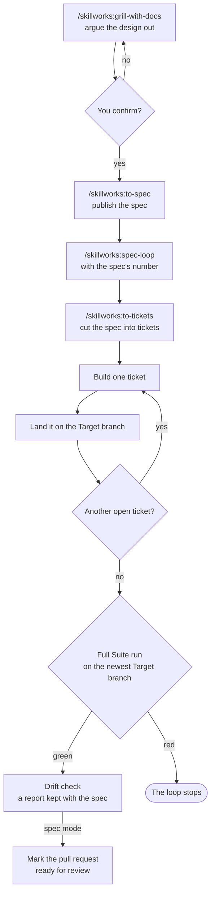
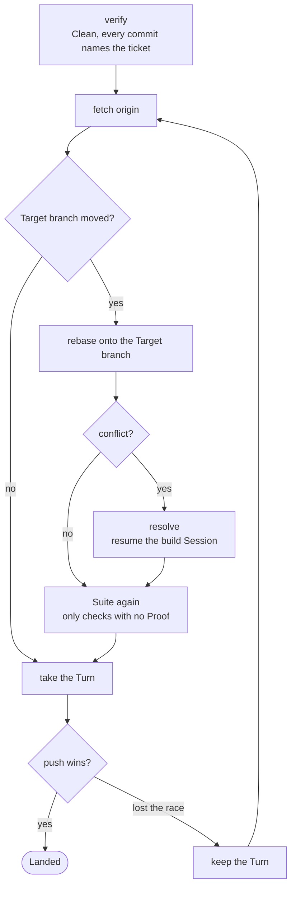

# The loop

How a design becomes code in your repo. Two stages, and one gate between them.

Stage one is an interview. You argue the design out with a Session, and the words and decisions are
written to your repo as they settle. It ends when you confirm the design.

Stage two is a script. It breaks the design into tickets and takes each one to your Target branch on
its own, in a worktree of its own, through a fixed run of Claude Code Sessions. Nobody watches it.



Your `yes` at the gate is the whole of your consent. Nothing between it and the drift report at the
end asks you anything, unless the loop stops.

## The Target branch

The **Target branch** is the branch a ticket Lands on. `target-branch` in `docs/agents/loop.json`
says which one it is. Setup asks you, and writes your answer there. It takes one of two kinds of
answer.

**A branch name**, such as `main`, `master` or `develop`. That branch is the Target branch for every
ticket of every spec. The loop cuts each Job branch from it, Lands each ticket on it, and pushes to it
straight away. The grill pushes each word and ADR to it as they settle.

```json
{ "target-branch": "main" }
```

Pick a branch name when your team pushes straight to that branch. Your GitHub login must be able to
push to it with no pull request and no status check. The preflight tests this, and stops if the push
would be refused.

**`spec`**. Each spec gets a branch of its own, `spec/<slug>`, and that branch is its Target branch.
Your team reviews the whole spec as one pull request to your default branch.

```json
{ "target-branch": "spec" }
```

Pick `spec` when your default branch is protected, or when your team reviews its work through pull
requests. The preflight checks that the default branch is on the remote, and does not care about its
protection. With `spec`:

- The grill makes `spec/<slug>` from the newest default branch when it settles the first word or ADR.
  It pushes it, and opens a draft pull request to the default branch. Each later word and ADR goes to
  that branch.
- When the grill settled nothing, `/skillworks:to-spec` makes the branch and the draft pull request.
- `/skillworks:to-spec` writes the branch name into the spec, under `## Branch`. The loop reads it
  there.
- Each ticket Lands on `spec/<slug>` exactly as it would on a branch name. Blocking, the push race and
  the Turn work the same. A closed ticket still means its code is on its Target branch.
- After the drift check, the loop marks the pull request ready for review, and stops. It never merges.
  A person reviews it and merges it.
- With the files Tracker, the loop never calls `gh`. It closes the spec, and its last lines tell you
  to open the pull request from the spec's branch on your host, or mark it ready for review.
- The pull request's body closes the spec, so the spec closes when the pull request merges.

Every other part of this page is the same for both kinds. Where it says the Target branch, read the
branch name you set, or `spec/<slug>`.

## The Tracker

The **Tracker** is where your team keeps its specs and tickets. `tracker` in `docs/agents/loop.json`
says which one it is. Setup asks you, and writes your answer there. It takes one of two answers.

**`github`**. A spec is a GitHub issue, and each ticket is a sub-issue of it. The loop reads and
writes them with `gh`.

```json
{ "tracker": "github" }
```

Pick `github` when your remote is on GitHub and has Issues turned on. Setup suggests it when `origin`
names `github.com`.

**`files`**. A spec is a folder in `.specs/`, and each ticket is a Markdown file in that folder. They
are committed to your repo, beside your code. The loop reads them with `git` alone, so it needs no
`gh`.

```json
{ "tracker": "files" }
```

Pick `files` when your remote is not on GitHub: GitLab, Bitbucket, or a bare repo on a shared drive.
Setup suggests it when `origin` does not name `github.com`. Any remote works. A repo with no remote
does not: setup stops, and prints the commands that add one.

The rest of this section is about `files`. With `github`, the rest of this page says how the loop
uses the issues.

### The `.specs/` folder

```
.specs/
  0007-local-tracker/
    spec.md
    tickets/
      01-read-loop-json.md
      02-close-in-worktree.md
```

Each spec is a folder, `<number>-<slug>`. `/skillworks:to-spec` writes it and pushes it. Its number
is one more than the highest number on the remote. When two specs are written at the same time, the
remote refuses the second push, and that spec takes the next number.

`/skillworks:to-tickets` writes one file for each ticket in `tickets/`. One file for each ticket
means two jobs never edit the same file.

A ticket's number is local to its spec. So a ticket is named by both numbers, `<spec>/<ticket>`:
`7/2` is ticket `02` of spec `0007`. You give the loop the spec's number, as you give it an issue
number: `/skillworks:spec-loop 7`.

### A spec file and a ticket file

Each file is plain Markdown, so you read and edit it in any editor. The frontmatter at the top holds
the state the loop reads. The text below it is what a Session reads.

A spec, `.specs/0007-local-tracker/spec.md`:

```markdown
---
status: open
---

# SPEC: A team without GitHub tracks its specs in committed files

## Problem Statement

A team whose remote is not GitHub cannot use the loop at all.
```

A ticket, `.specs/0007-local-tracker/tickets/02-close-in-worktree.md`:

```markdown
---
status: open
blocked-by: [1]
claimed-by:
---

# TICKET: Close the ticket in the worktree

## What to build

The ticket's Session closes its own ticket, in the same commit as its code.

## Acceptance criteria

- [ ] The close and the code are in one commit.

## Blocked by

- 1
```

| Field | Where | What it holds | Who writes it |
|---|---|---|---|
| `status` | `spec.md` and each ticket | `open` or `closed`. | `to-spec` and `to-tickets` write `open`. The loop closes it. |
| `blocked-by` | Each ticket | The numbers of the tickets in the same spec that must close first. | `to-tickets`. |
| `claimed-by` | Each ticket | The `user.email` of the loop that took the ticket. | The loop. Leave it empty. |
| `branch` | `spec.md`, when `target-branch` says `spec` | The spec's own branch, `spec/<slug>`. | `to-spec`. |

You can edit a file by hand, like any other file. Push the edit to the Target branch, because the
loop reads the files there and not in your checkout.

### A claim and a close

- **Reading.** The loop fetches the Target branch from `origin`, and reads `.specs/` there. So it sees
  what every other loop and every teammate has pushed.
- **Picking.** A ticket can start when it is open, nobody has claimed it, and each ticket in its
  `blocked-by` is closed.
- **Claiming.** The loop sets `claimed-by: <your user.email>` in a commit, and pushes it to the Target
  branch. If the remote refuses the push, another loop moved first. The loop reads again, and claims
  the next free ticket. A lost push race is what stops two loops from taking one ticket.
- **Closing a ticket.** `finish` sets `status: closed` and adds a `## Closing note` at the end of the
  ticket file, in the same commit as the code. The note holds what a closing comment holds on
  GitHub: what was done, which tests prove it, and which checks did not run. The close reaches the
  remote only when the ticket Lands. So a ticket is never closed without its code.
- **Closing the spec.** After the last ticket and the drift check, the loop sets `status: closed` in
  `spec.md` and pushes it. Do not close a spec by hand while a loop runs on it.

With `spec` as your Target branch, the spec's folder sits on `spec/<slug>`. So its pull request
carries the spec and its code together.

### Why `.specs/` is committed

Do not add `.specs/` to `.gitignore`. Each job builds in a worktree of its own, and a worktree cannot
see a gitignored folder of your checkout. A job that cannot see its ticket cannot build it or close
it.

Committed, the files give three things. Every teammate and every loop reads the same state. A claim is
a pushed commit, so it holds. And a close goes in the same commit as its code.

## Stage one: settle the design

### The grill

`/skillworks:grill-with-docs` asks the questions one at a time. Each one is numbered and carries a
recommended answer. It asks only what can be answered now: a question that hangs on a decision you
have not made yet waits for that decision.

Finding facts is never your job. A question that needs a fact from the code or the Tracker goes to a
sub-agent. The decisions are yours. The lookups are not.

Your glossary, `CONTEXT.md`, and your ADRs in `docs/adr/` are edited the moment a word or a decision
settles, not at the end. Every Session after this one starts with an empty context, and can only find
those decisions in the repo.

### The gate

When no question is left, the Session sums up the problem, the design, the words and ADRs written on
the way, and what was ruled out. Then it asks you to confirm.

- On **no**, what you said becomes the next round of questions.
- On **yes**, everything after runs with nobody watching. So the summary is the thing you consent to.
  It carries every decision the spec will be built from.

### The spec

On your yes, `/skillworks:to-spec` runs. With `github`, it publishes a `SPEC:` issue with the
`ready-for-agent` label. With `files`, it writes the spec's folder in `.specs/` and pushes it. It
commits and pushes what the interview changed on disk to the Target branch, and it reports the spec's
number. With `spec`, the spec names its own branch: under `## Branch` in the issue, or as `branch` in
`spec.md`.

The push matters as much as the spec. The spec points at decisions that must already be in the repo,
because no later Session can see this one.

That number is what you give to `/skillworks:spec-loop`.

## Stage two: build it

### The tickets

`/skillworks:spec-loop <spec>` checks that the spec is open, then runs `/skillworks:to-tickets`. That
cuts the spec into tickets. Each ticket is a thin slice through every layer, small enough for one
fresh Session, and it names the tickets that must land before it. With `github`, each one is published
as a **sub-issue of the spec**. With `files`, each one is a file in the spec's `tickets/` folder.
Either way, a ticket belongs to one spec, and that is what stops two people's loops from taking each
other's work.

Then the skill starts the `spec-loop` script in the background, and tells you where its log is. The
script does the rest. The skill never builds a ticket itself.

Before the script starts work, it checks that `claude` is on `PATH`, and that the spec is open and has
tickets. With `github`, it checks that `gh` is logged in. With `files`, it checks that git has a
`user.email`, because it claims each ticket in that name. It records where the Target branch stood on `origin` in
`.spec-loop/<spec>/base.sha`.
That file is written once, so a restarted run still measures from where the first run began.

**Picking a ticket** is a query, not a judgement. The script takes the spec's first open ticket that
has no open blocker and that nobody has claimed.

**Claiming** it, with `github`, assigns itself, waits three seconds, and reads the assignees back.
Another name there means it lets the ticket go and moves on. With `files`, a claim is a pushed commit,
as [the Tracker](#a-claim-and-a-close) says.

Open tickets that are all blocked or claimed by someone else stop the run with a `STUCK` line.

### Worktrees and Job branches

Each ticket is built in a worktree of its own, cut from the newest Target branch on `origin`:

| What | Where |
|---|---|
| The worktree | `.claude/worktrees/spec-<spec>/ticket-<n>` |
| The Job branch | `spec-loop/<spec>/ticket-<n>` |

Your own checkout is never worked in. You keep it, on any branch, with any edits in it, for the whole
run. A ticket that Lands has its worktree and its Job branch removed. A ticket that stops keeps both,
so you can read what went wrong.

### The steps of one ticket

<!-- steps -->
build → standards → spec → architecture → fix → sweep → suite → finish


Every step but `suite` is a Session of its own, run inside the ticket's worktree.

| Step | What it does |
|---|---|
| `build` | Builds the change test-first, and leaves it uncommitted. |
| `standards` | Reviews the change against your rules, and fixes what it finds. |
| `spec` | Reviews the change against the ticket and the spec, and fixes what it finds. |
| `architecture` | Reviews where the change sits and which way it points, and fixes what it finds. |
| `fix` | Reads all three reports at once, settles any disagreement, and fixes what is left. |
| `sweep` | Cuts the comments back to what your rules keep. |
| `suite` | The script runs your Suite. No Session is asked. |
| `finish` | Commits the change with the ticket named in the message, and closes the ticket. It never pushes. |

The three reviews start cold. A review that resumed the build Session would mark its own work. `fix`
and `finish` resume the build Session, because they act on the code it wrote.

`sweep` comes after `fix`, because every step that writes could put back a comment the sweep cut.

The script reads a fact after each step, because a Session can end cleanly and still do nothing. It
reads the step's result, git and the ticket's state. For example, `build` must leave the worktree
changed, and `finish` must leave a new commit, a Clean worktree and a closed ticket.

**An Edit.** A review can change the code. So the script reads the worktree before and after each
review, and the difference is that review's Edit. It goes to the log as an `EDIT` line and into the
`fix` prompt beside the report. An Edit never stops the loop. It is only never silent.

### The Suite

The Suite is the checks your repo names in `docs/agents/suite.json`. The script runs them itself,
reads the exit status, and keeps the output. So the gate that says a ticket is done rests on nothing a
Session said about itself. [The Suite](suite.md) has the whole file.

Each time a check passes, the Suite keeps a **Proof**: the check, and the exact inputs it passed on.
A check's inputs are every file in the worktree that git does not ignore, less the paths the check
lists under `ignores`. A check whose inputs match a Proof does not run. Its line in the Suite output
says so and names the Proof, so a ticket's record shows what an earlier run proved as well as what
this one did.

Proofs stay in your clone, and every worktree and every loop in it shares them. So a Session that
runs `skillworks-suite` while it builds keeps Proofs the `suite` step reads, and the ticket does not
pay for the same checks twice.

First the script proves the machine can run the checks that will run. Each `ready` command runs, one
by one. A machine that is not ready is not a red Suite: the loop stops and names what is missing.
Then the checks run together, so the Suite takes as long as its slowest check.

**A red Suite goes round once.** Red on every one of its `runs` belongs to the ticket. The script puts
the failing output into the `fix` prompt, then runs `sweep`, then the Suite again. Green carries on to
`finish`. Red a second time stops the loop. There is never a second round. The checks that passed
before the fix keep their Proofs, so the second Suite runs only the red checks and the checks whose
inputs the fix changed.

## Rebasing and Landing

A ticket Lands the moment it passes, on its own. So a stopped run leaves every ticket before it
already on the Target branch.



1. **Verify.** The worktree is Clean, and every commit carries a `Ticket:` trailer, so it can be
   traced back. With `github` it says `Ticket: #<n>`. With `files` it names the spec and the ticket,
   such as `Ticket: 7/2`.
2. **Fetch** `origin`.
3. **Rebase** onto the newest Target branch, only when it moved. Then the script checks that no commit
   and no file was lost.
4. **Resolve**, only when the rebase conflicts. The build Session is resumed to fix it. It is told
   that it wrote one side and the other side is a stranger's, so it argues for the other side before
   it drops a line of it. It gets the commits that landed meanwhile, and the ticket behind each one.
5. **The Suite again**, on the new base. Only the checks with no Proof for the rebased files run, so
   most landings run nothing. An unmoved base skips this, because the `suite` step already answers
   for it.
6. **Push** to the Target branch.

Nothing is pushed unless every step passes.

### The push race and the Turn

Two loops in one clone can finish at the same time. Both push, and one loses: its push is turned down
because the Target branch moved. That is a lost push race, and it is expected.

The **Turn** is the right to push, held by one loop at a time in one clone. A loop takes the Turn only
for its push. A loop that lost a race takes the Turn and keeps it from its next fetch until it Lands,
so the loops beside it cannot beat it again. It goes back to fetch, rebases, runs the Suite, and
pushes again, with no cap on tries.

A loop that waits says so in the log, and names who holds the Turn:

```
note  #203 waits for the Turn, which spec #200 ticket #199 holds
```

The Turn orders the loops of one clone only. A push from another machine can still win, and the loop
tries again. Any push failure that is not a lost race stops the landing with git's message.

## When a step fails


**A Nudge.** A Session can stop before its work is done: no report written, nothing committed, the
ticket still open. The script then resumes that same Session and names what is still owed, so it
carries on with what it knows. Two Nudges are the limit. A step that still owes work after them stops
the loop. A Session that could not run at all, such as one that ended in an error or never loaded its
command, gets no Nudge. It stops the loop at once.

**A stop.** Every other failure stops the run where it stands. The one rescue is the round a red Suite
goes, above. The script reopens the ticket, because `finish` may have closed it before its work
reached the Target branch, and the loop only picks open tickets. If this run landed a ticket before
the stop, the full run below runs next. The `FAIL` line in the log names the worktree and the files to read:

```
FAIL  #203 step fix failed check ticket-open. Its worktree is at .claude/worktrees/spec-200/ticket-203. See ...
```

### Restarting a stopped run: the Keep

To restart, run the same command again: `spec-loop <spec>`.

It first does a **Keep** on the worktrees the stopped run left behind. For each one, it commits any
uncommitted work to the Job branch, removes the worktree, and renames the Job branch out of the way,
to `spec-loop/<spec>/ticket-<n>-kept-1`. A Keep discards nothing. The log says what it kept:

```
KEPT  ticket-203 held uncommitted work. The whole attempt is on branch spec-loop/200/ticket-203-kept-1
```

**Held** means the worktree had uncommitted work, and the Keep committed it. **Clean** means it had
none. Either way, the attempt is on that branch if you want to read it.

Then the run starts the first open ticket again from the Target branch, with a fresh build.

### A Denial, and `--bypass`

A **Denial** is a tool call Claude Code turned down because the Session had no permission for it: a
write to a protected path, or a command no allow rule names. A Session with nobody watching cannot ask
you, so a Denial is final. A write under `.claude/` is always turned down in the default mode, whatever
your allow rules say.

Many Denials are worked around. When a step stops and its result lists Denials, the `FAIL` line names
each one and adds a hint:

```
      Denial: Write {"file_path": ".claude/settings.json", ...
      If one of these Denials stopped the step, rerun with spec-loop 200 --bypass
```

The default mode is `acceptEdits`. `spec-loop <spec> --bypass` runs every Session of the run in
`bypassPermissions`, the landing too. Use it only when a Denial stopped the step. A stop with no
Denials gives no hint, because its cause lies somewhere else. The `LOOP` line at the top of the log
names the mode the run is in.

## The full run

A Proof knows only the files in your repo. A change outside it, such as a new SDK, can leave a Proof
stale. So after each loop run that landed at least one ticket, the script runs the whole Suite once
more, on the newest Target branch on `origin`, in a worktree of its own. It does this when the loop
stopped early too, because the tickets that landed are on the Target branch all the same.

The full run trusts no Proof and uses no image, so every check runs on your own machine. A check that
goes red there loses all its Proofs, so a stale Proof cannot skip it again.

A red full run stops the loop, and the drift check does not run. The `RED` line names the red checks
and the tickets that landed in the run. The spec stays open, and no Session is asked to fix it: a red
Target branch is yours to decide on. [The Suite](suite.md) says more.

## The drift check

Every ticket passed its own acceptance criteria. Nothing so far has asked whether all of them together
are what the spec wanted.

So when no open ticket is left and the full run is green, the script opens one last worktree and runs
`/skillworks:spec-drift <spec> <base>` in a fresh Session. It judges the work against the spec, not the
tickets, because a ticket that drifted still passed its own criteria. It records one report with the
spec, under the heading `## Drift report`. With the GitHub Tracker the report is a comment on the spec
issue. With the files Tracker there is no issue, so the report goes at the end of the spec's `spec.md`.
The script then reads the report back from the Tracker and keeps a copy at
`.spec-loop/<spec>/drift.md`. If it finds none, the log says so on a `WARN` line.

The report puts each user story and each decision of the spec in one of four groups:

| Mark | What it means |
|---|---|
| Done | The code does what the spec asked. |
| Partial | Some of it is there, and the report says what is not. |
| Missing | None of it is there. |
| Contradicts | The code does something the spec ruled out. |

It also lists anything **Unrequested**: work the spec never asked for. And it looks for two tickets
that brought in two names for one idea, with your glossary as the judge.

The drift check fixes nothing and closes nothing. A fix is new work, and needs a ticket of its own.
Closing the spec is where a person says the work is done. With a branch name, a person closes it by
hand. With `spec`, the loop marks the spec's pull request ready for review, and the spec closes when a
person merges it. With the files Tracker, the loop closes the spec itself after the drift check, and
with `spec` it leaves the pull request to you. A clean finish needs two facts: the log reaches its
`END` line, and the drift report lists nothing Missing, Partial or Contradicts.

## The stage map

Each stage of the loop reads some of your Steering. This map says which files, and where your team can
change what the stage does. [Steering](steering.md) has the detail on each file.

Two kinds of load:

- **Always** means the file is in the Session from its start. `CLAUDE.md` loads, and it imports the
  four rules in `docs/agents/rules/`: `comments.md`, `determinism.md`, `file-placement.md` and
  `words.md`. The map calls these "`CLAUDE.md` and the rules".
- **On demand** means a skill reads the file only when that stage needs it.

`.claude/settings.json` applies to every Session too. Its allowlist decides which tools a Session can
use with nobody watching.

<!-- stage map -->
| Stage | Always loads | Loads on demand | What your team can change |
|---|---|---|---|
| The grill | `CLAUDE.md` and the rules | `domain.md`, your glossary, `docs/adr/` | The glossary and the ADRs. The grill writes them as words and decisions settle. |
| The gate | The same Session as the grill | Nothing more | Nothing in a file. Your yes or no is the lever. |
| The spec | `CLAUDE.md` and the rules | `issue-tracker.md`, your glossary, `docs/adr/` | The glossary and the ADRs, which give the spec its words and its decisions. |
| The tickets | `CLAUDE.md` and the rules | `issue-tracker.md` | "The ticket shape" in `issue-tracker.md`: the size of a ticket, its title and its sections. |
| `build` | `CLAUDE.md` and the rules | `domain.md`, your glossary, and `suite.json` when it runs `skillworks-suite` | The rules the change must meet, and the checks in `suite.json`. |
| `standards` | `CLAUDE.md` and the rules | `smell-baseline.md`, your glossary | The rules, and the smells in `smell-baseline.md`. |
| `spec` | `CLAUDE.md` and the rules | `issue-tracker.md` | "The ticket shape" in `issue-tracker.md`, because the review judges the change by the ticket. |
| `architecture` | `CLAUDE.md` and the rules | `domain.md`, your glossary, `docs/adr/`, `arrangement-baseline.md`, `placement-checks.md` | `file-placement.md`, the failures in `arrangement-baseline.md`, and the commands in `placement-checks.md`. |
| `fix` | `CLAUDE.md` and the rules | Nothing more. It acts on the three reports. | The rules the fix must meet. |
| `sweep` | `CLAUDE.md` and the rules | Nothing more. `comments.md` is already loaded. | The keep and cut table in `comments.md`, and `doc-comments`. |
| `suite` | Nothing. No Session runs. | `suite.json`, and each Dockerfile a check names as its `image` | Every check, its `ready`, its `ignores`, its `image`, and `runs`. |
| `finish` | `CLAUDE.md` and the rules | `issue-tracker.md` | Nothing. The loop reads back the two conventions in `issue-tracker.md`, so leave them as they are. |
| Landing | `CLAUDE.md` and the rules, in the Session that resolves a conflict | `suite.json`, for the Suite again | The checks in `suite.json`. |
| The full run | Nothing. No Session runs. | `suite.json` | The checks in `suite.json`. |
| The drift check | `CLAUDE.md` and the rules | `issue-tracker.md`, your glossary | The glossary, which judges the names two tickets brought in. |

The steps, their order and what each one does are Machinery. They are the same in every repo, and no
file changes them. So this map lives here only, and setup copies no map into your repo.

## Reading a run

The log is `.spec-loop/<spec>/loop.log`. Every step's result and error output sits beside it.

```
15:55:22 START #202 TICKET: Preflight checks for uv
15:55:32 STEP  #202 build        2/6
15:57:41 STEP  #202 standards    2/6
15:59:38 EDIT  #202 standards    changed scripts/preflight.py
16:02:18 STEP  #202 fix          2/6
16:29:54 STEP  #202 finish       2/6
16:56:48 ok    #202 landed on master as bfa44a6 in 1 try, holding the Turn for its push
16:56:52 DONE  #202  bfa44a6
16:57:06 STEP  #203 build        3/6  ~245m left
```

The position counts closed tickets, so a restarted run starts at its real place. The time left is the
mean of the tickets this run has finished, with the one now running counted as still to do.

Expect a long run. A ticket can take from half an hour to a few hours.

`spec-loop <spec> --dry-run` prints the whole plan instead of running it: every ticket, its worktree
and Job branch, every step's command and facts, and the landing steps. It starts no Session and
reaches no remote.
