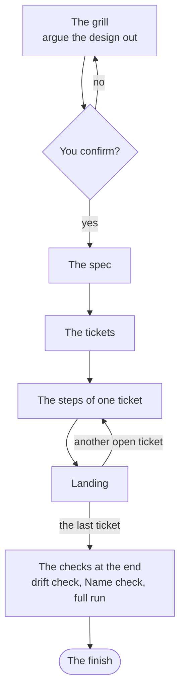

# The Dev loop

How a design becomes code in your repo. The Dev loop has two stages, and one gate between them.

Stage one is an interview. You argue the design out with a Session, and the words and decisions are
written to your repo as they settle. It ends when you confirm the design.

Stage two is a script. It breaks the design into tickets and takes each one to your Target branch on
its own, in a worktree of its own, through a fixed run of Claude Code Sessions. Nobody watches it.

Your `yes` at the gate is the whole of your consent. Nothing between it and the drift report at the
end asks you anything, unless the loop stops.

## The pages of the loop

Each page below holds one part of the loop, in the order a run takes them.

| Page | What it answers |
|---|---|
| [The Target branch](the-loop/target-branch.md) | Which branch a ticket Lands on, and how to choose between a branch name and `spec`. |
| [The Tracker](the-loop/tracker.md) | Where your specs and tickets live, and how the `files` Tracker keeps them in `.specs/`. |
| [Stage one: settle the design](the-loop/the-grill.md) | What the grill asks, what your yes at the gate consents to, and the shape of the spec it publishes. |
| [The tickets](the-loop/tickets.md) | How the Cut makes the tickets, how a ticket is picked and claimed, and where it is built. |
| [The steps of one ticket](the-loop/steps.md) | What is done to a ticket before it Lands, from `build` to `finish`, and how the Suite runs. |
| [Rebasing and Landing](the-loop/landing.md) | How a ticket reaches the Target branch: the rebase, the push race and the Turn. |
| [The drift check](the-loop/drift-check.md) | How the finished work is judged against the spec: the Verdicts, the count and the Gap round. |
| [The Name check](the-loop/name-check.md) | How the names the spec brought in are judged: the Name report, the rename ticket and the Name re-check. |
| [The full run](the-loop/full-run.md) | What the whole Suite proves once the checks at the end are done, and what has to be true before the loop writes `END`. |
| [When a step fails](the-loop/stops.md) | What stops the loop and what each stop line says, how to restart with the Keep, and when to rerun with `--bypass`. |
| [Reading a run](the-loop/reading-a-run.md) | What each line of the log says, and what a dry run prints. |
| [The stage map](the-loop/stage-map.md) | Which Steering files each stage loads, and where your team can change what the stage does. |
