# The Dev loop

How a design becomes code in your repo. The Dev loop has two stages, and one gate between them.

Stage one is an interview. You argue the design out with a Session, and the words and decisions are
written to your repo as they settle. It ends when you confirm the design.

Stage two is a script. It breaks the design into tickets and takes each one to your Target branch on
its own, in a worktree of its own, through a fixed run of Claude Code Sessions. Nobody watches it.

```mermaid
flowchart TD
    grill["/skillworks:grill<br/>argue the design out"] --> gate{"You confirm?"}
    gate -- no --> grill
    gate -- yes --> spec["/skillworks:to-spec<br/>publish the spec"]
    spec --> loop["/skillworks:spec-loop<br/>with the spec's number"]
    loop --> any{"The spec has tickets?"}
    any -- yes --> ticket["Build one ticket"]
    any -- no --> tickets["/skillworks:to-tickets<br/>the driver cuts the spec into tickets"]
    tickets --> ticket
    ticket --> land["Land it on the Target branch"]
    land --> more{"Another open ticket?"}
    more -- yes --> ticket
    more -- no --> drift["Drift check<br/>a report kept with the spec"]
    drift --> count{"Every Verdict<br/>Done or In step?"}
    count -- yes --> names["Name check<br/>a Name report kept with the spec"]
    count -- "a Gap" --> gaps["The Gap ticket<br/>filed under the spec, built like any ticket"]
    gaps --> recheck["Drift check again<br/>on the Gap items alone"]
    recheck --> recount{"Every Verdict<br/>Done or In step?"}
    recount -- yes --> names
    recount -- "no: one round only" --> last
    names --> renamed{"No rename owed?"}
    renamed -- yes --> full{"Full Suite run, once<br/>on the newest Target branch"}
    renamed -- "a rename" --> renames["The rename ticket<br/>filed under the spec, built like any ticket"]
    renames --> namerecheck["Name check again<br/>on the rename ticket alone"]
    namerecheck --> made{"Every rename Done?"}
    made -- yes --> full
    made -- no --> last
    count -- "a Contradicts" --> last["Full Suite run, once"] --> stop(["The loop stops"])
    full -- red --> stop
    full -- green --> clean["A clean finish<br/>END, and the spec closes with files"]
    clean -- "spec mode" --> ready["Mark the pull request<br/>ready for review"]
```



Your `yes` at the gate is the whole of your consent. Nothing between it and the drift report at the
end asks you anything, unless the loop stops.

## The Target branch

The **Target branch** is the branch a ticket Lands on. `target-branch` in `docs/agents/loop.json`
says which one it is. Setup asks you, and writes your answer there. It takes one of two kinds of
answer.

**A branch name**, such as `main`, `master` or `develop`. That branch is the Target branch for every
ticket of every spec. The loop cuts each Job branch from it, Lands each ticket on it, and pushes to it
straight away. The grill pushes each word and ADR to it as they settle.

```json
{ "target-branch": "main" }
```

Pick a branch name when your team pushes straight to that branch. Your GitHub login must be able to
push to it with no pull request and no status check. The preflight tests this, and stops if the push
would be refused.

**`spec`**. Each spec gets a branch of its own, `spec/<slug>`, and that branch is its Target branch.
Your team reviews the whole spec as one pull request to your default branch.

```json
{ "target-branch": "spec" }
```

Pick `spec` when your default branch is protected, or when your team reviews its work through pull
requests. The preflight checks that the default branch is on the remote, and does not care about its
protection. With `spec`:

- The grill makes `spec/<slug>` from the newest default branch when it settles the first word or ADR.
  It pushes it, and opens a draft pull request to the default branch. Each later word and ADR goes to
  that branch.
- When the grill settled nothing, `/skillworks:to-spec` makes the branch and the draft pull request.
- `/skillworks:to-spec` writes the branch name into the spec, under `## Branch`. The loop reads it
  there.
- Each ticket Lands on `spec/<slug>` exactly as it would on a branch name. Blocking, the push race and
  the Turn work the same. A closed ticket still means its code is on its Target branch.
- After the drift check, the loop marks the pull request ready for review, and stops. It never merges.
  A person reviews it and merges it.
- With the files Tracker, the loop never calls `gh`. It closes the spec, and its last lines tell you
  to open the pull request from the spec's branch on your host, or mark it ready for review.
- The pull request's body closes the spec, so the spec closes when the pull request merges.

Every other part of this page is the same for both kinds. Where it says the Target branch, read the
branch name you set, or `spec/<slug>`.

## The Tracker

The **Tracker** is where your team keeps its specs and tickets. `tracker` in `docs/agents/loop.json`
says which one it is. Setup asks you, and writes your answer there. It takes one of two answers.

**`github`**. A spec is a GitHub issue, and each ticket is a sub-issue of it. The loop reads and
writes them with `gh`.

```json
{ "tracker": "github" }
```

Pick `github` when your remote is on GitHub and has Issues turned on. Setup suggests it when `origin`
names `github.com`.

**`files`**. A spec is a folder in `.specs/`, and each ticket is a Markdown file in that folder. They
are committed to your repo, beside your code. The loop reads them with `git` alone, so it needs no
`gh`.

```json
{ "tracker": "files" }
```

Pick `files` when your remote is not on GitHub: GitLab, Bitbucket, or a bare repo on a shared drive.
Setup suggests it when `origin` does not name `github.com`. Any remote works. A repo with no remote
does not: setup stops, and prints the commands that add one.

The rest of this section is about `files`. With `github`, the rest of this page says how the loop
uses the issues.

### The `.specs/` folder

```
.specs/
  0007-local-tracker/
    spec.md
    tickets/
      01-read-loop-json.md
      02-close-in-worktree.md
```

Each spec is a folder, `<number>-<slug>`. `/skillworks:to-spec` writes it and pushes it. Its number
is one more than the highest number on the remote. When two specs are written at the same time, the
remote refuses the second push, and that spec takes the next number.

`/skillworks:to-tickets` writes one file for each ticket in `tickets/`. One file for each ticket
means two jobs never edit the same file.

A ticket's number is local to its spec. So a ticket is named by both numbers, `<spec>/<ticket>`:
`7/2` is ticket `02` of spec `0007`. You give the loop the spec's number, as you give it an issue
number: `/skillworks:spec-loop 7`.

### A spec file and a ticket file

Each file is plain Markdown, so you read and edit it in any editor. The frontmatter at the top holds
the state the loop reads. The text below it is what a Session reads.

A spec, `.specs/0007-local-tracker/spec.md`:

```markdown
---
status: open
---

# SPEC: A team without GitHub tracks its specs in committed files

## Problem Statement

A team whose remote is not GitHub cannot use the loop at all.
```

A ticket, `.specs/0007-local-tracker/tickets/02-close-in-worktree.md`:

```markdown
---
status: open
blocked-by: [1]
claimed-by:
---

# TICKET: Close the ticket in the worktree

## What to build

The ticket's Session closes its own ticket, in the same commit as its code.

## Acceptance criteria

- [ ] The close and the code are in one commit.

## Blocked by

- 1
```

| Field | Where | What it holds | Who writes it |
|---|---|---|---|
| `status` | `spec.md` and each ticket | `open` or `closed`. | `to-spec` and `to-tickets` write `open`. The loop closes it. |
| `blocked-by` | Each ticket | The numbers of the tickets in the same spec that must close first. | `to-tickets`. |
| `claimed-by` | Each ticket | The `user.email` of the loop that took the ticket. | The loop. Leave it empty. |
| `branch` | `spec.md`, when `target-branch` says `spec` | The spec's own branch, `spec/<slug>`. | `to-spec`. |

You can edit a file by hand, like any other file. Push the edit to the Target branch, because the
loop reads the files there and not in your checkout.

### A claim and a close

- **Reading.** The loop fetches the Target branch from `origin`, and reads `.specs/` there. So it sees
  what every other loop and every teammate has pushed.
- **Picking.** A ticket can start when it is open, nobody has claimed it, and each ticket in its
  `blocked-by` is closed.
- **Claiming.** The loop sets `claimed-by: <your user.email>` in a commit, and pushes it to the Target
  branch. If the remote refuses the push, another loop moved first. The loop reads again, and claims
  the next free ticket. A lost push race is what stops two loops from taking one ticket.
- **Closing a ticket.** `finish` sets `status: closed` and adds a `## Closing note` at the end of the
  ticket file, in the same commit as the code. The note holds what the Closing note holds on
  GitHub: what was done, which tests prove it, and which checks did not run. The close reaches the
  remote only when the ticket Lands. So a ticket is never closed without its code.
- **Closing the spec.** After the last ticket and the drift check, the loop sets `status: closed` in
  `spec.md` and pushes it. Do not close a spec by hand while a loop runs on it.

With `spec` as your Target branch, the spec's folder sits on `spec/<slug>`. So its pull request
carries the spec and its code together.

### Why `.specs/` is committed

Do not add `.specs/` to `.gitignore`. Each job builds in a worktree of its own, and a worktree cannot
see a gitignored folder of your checkout. A job that cannot see its ticket cannot build it or close
it.

Committed, the files give three things. Every teammate and every loop reads the same state. A claim is
a pushed commit, so it holds. And a close goes in the same commit as its code.

## Stage one: settle the design

### The grill

`/skillworks:grill` asks the questions one at a time. Each one is numbered and carries a
recommended answer. It asks only what can be answered now: a question that hangs on a decision you
have not made yet waits for that decision.

Finding facts is never your job. A question that needs a fact from the code or the Tracker goes to a
sub-agent. The decisions are yours. The lookups are not.

Your glossary, `CONTEXT.md`, and your ADRs in `docs/adr/` are edited the moment a word or a decision
settles, not at the end. Every Session after this one starts with an empty context, and can only find
those decisions in the repo.

When no design question is left, the grill walks your Surfaces: the places in
`docs/agents/surfaces.md` a change can have to reach besides its code. It asks about one Surface at a
time, and skips a Surface the change does not touch. Each answer becomes a requirement the spec
carries. A file with no Surface in it skips this step. [Steering](steering.md#the-surfaces-file) says
how to write the file.

### The gate

When no question is left, the Session sums up the problem, the design, each Surface's answer, the
words and ADRs written on the way, and what was ruled out. Then it asks you to confirm.

- On **no**, what you said becomes the next round of questions.
- On **yes**, everything after runs with nobody watching. So the summary is the thing you consent to.
  It carries every decision the spec will be built from.

### The spec

On your yes, `/skillworks:to-spec` runs. With `github`, it publishes a `SPEC:` issue with the
`ready-for-agent` label. With `files`, it writes the spec's folder in `.specs/` and pushes it. It
commits and pushes what the interview changed on disk to the Target branch, and it reports the spec's
number. With `spec`, the spec names its own branch: under `## Branch` in the issue, or as `branch` in
`spec.md`. Its Surfaces section holds the requirement the grill captured for each Surface the change
touches.

The loop counts the drift check's Verdicts against the spec, so three sections come in a fixed shape,
the **counted shape**:

- **User Stories** is a numbered list that starts at 1, and skips and repeats no number. Each story
  is an item, called `S1`, `S2` and on.
- **Implementation Decisions** is a numbered list in the same way. Each decision is an item, called
  `D1`, `D2` and on.
- **Surfaces** holds one list item per Surface, and each item opens with the Surface's name in bold,
  such as `- **The user docs** (docs/usage/): ...`. The bold name is the item. A spec that touches no
  Surface says "None" there, and has no Surface items.

A line indented under an item is part of it, so a nested list or a snippet stays with its item.
Testing Decisions are not counted, because the Suite already proves them. `to-spec` writes every spec
in this shape.

The loop reads the shape before it claims any ticket. A spec in another shape is turned down then, in
seconds, and no ticket runs. The stop names each fault: a missing heading, a section with no numbered
list, a skipped or repeated number, or a Surface item with no bold name.

The push matters as much as the spec. The spec points at decisions that must already be in the repo,
because no later Session can see this one.

That number is what you give to `/skillworks:spec-loop`.

## Stage two: build it

### The tickets

`/skillworks:spec-loop <spec>` checks that the spec is open, then starts the `spec-loop` script in
the background, and tells you where its log is. The script does the rest. The skill never cuts a
ticket or builds one itself.

The script cuts the tickets as its first step, after it checks the spec's shape and before the first
ticket, and only when the spec has none. The step starts a Session that types
`/skillworks:to-tickets <spec>` and tells it to skip its approval questions, because nobody is at the
terminal to answer them. The slices it shows are written to the loop log, so you can read them while
the work runs. A spec that still has no tickets after the step stops the loop with a `STOP` line. A
spec that already has tickets, such as one a restarted run meets, skips the step.

Each ticket is a thin slice through every layer, small enough for one fresh Session, and it names the
tickets that must land before it. With `github`, each one is published as a **sub-issue of the
spec**. With `files`, each one is a file in the spec's `tickets/` folder.
Either way, a ticket belongs to one spec, and that is what stops two people's loops from taking each
other's work.

Each Surface in the spec's Surfaces section goes into the ticket whose change needs it. No ticket only
updates a Surface, so every ticket that Lands leaves each Surface in step.

Before the script starts work, it checks that `claude` is on `PATH`, and that the spec is open.
With `github`, it checks that `gh` is logged in. With `files`, it checks that git has a
`user.email`, because it claims each ticket in that name. It records where the Target branch stood on `origin` in
`.spec-loop/<spec>/base.sha`.
That file is written once, so a restarted run still measures from where the first run began.

**Picking a ticket** is a query, not a judgement. The script takes the spec's first open ticket that
has no open blocker and that nobody has claimed.

**Claiming** it, with `github`, assigns itself, waits three seconds, and reads the assignees back.
Another name there means it lets the ticket go and moves on. With `files`, a claim is a pushed commit,
as [the Tracker](#a-claim-and-a-close) says.

Open tickets that are all blocked or claimed by someone else stop the run with a `STUCK` line.

### Worktrees and Job branches

Each ticket is built in a worktree of its own, cut from the newest Target branch on `origin`:

| What | Where |
|---|---|
| The worktree | `.claude/worktrees/spec-<spec>/ticket-<n>` |
| The Job branch | `spec-loop/<spec>/ticket-<n>` |

Your own checkout is never worked in. You keep it, on any branch, with any edits in it, for the whole
run. A ticket that Lands has its worktree and its Job branch removed. A ticket that stops keeps both,
so you can read what went wrong.

### The steps of one ticket

<!-- steps -->
build → standards → spec → architecture → fix → sweep → suite → finish


Every step but `suite` is a Session of its own, run inside the ticket's worktree.

| Step | What it does |
|---|---|
| `build` | Builds the change test-first, and leaves it uncommitted. |
| `standards` | Reviews the change against your rules, and fixes what it finds. |
| `spec` | Reviews the change against the ticket and the spec, and each Surface the spec names for the ticket, and fixes what it finds. |
| `architecture` | Reviews where the change sits and which way it points, and fixes what it finds. |
| `fix` | Reads all three reports at once, settles any disagreement, and fixes what is left. |
| `sweep` | Cuts the comments back to what your rules keep. |
| `suite` | The script runs your Suite. No Session is asked. |
| `finish` | Commits the change with the ticket named in the message, and closes the ticket. It never pushes. |

The three reviews start cold. A review that resumed the build Session would mark its own work. `fix`
and `finish` resume the build Session, because they act on the code it wrote.

`sweep` comes after `fix`, because every step that writes could put back a comment the sweep cut.

The script reads a fact after each step, because a Session can end cleanly and still do nothing. It
reads the step's result, git and the ticket's state. For example, `build` must leave the worktree
changed, and `finish` must leave a new commit, a Clean worktree and a closed ticket.

**An Edit.** A review can change the code. So the script reads the worktree before and after each
review, and the difference is that review's Edit. It goes to the log as an `EDIT` line and into the
`fix` prompt beside the report. An Edit never stops the loop. It is only never silent.

**The run by hand.** `/skillworks:implement <n>` with no flag runs the same steps in one Session. Its
review is `/skillworks:review-changes`, which runs the three review skills the loop runs, each in a
sub-agent of its own. By hand, the reviews report and edit nothing, and `implement` fixes what they
found. Run `/skillworks:review-changes` on its own to review a branch against a fixed point. For a
check on correctness alone, run Claude Code's own `/code-review`.

### The Suite

The Suite is the checks your repo names in `docs/agents/suite.json`. The script runs them itself,
reads the exit status, and keeps the output. So the gate that says a ticket is done rests on nothing a
Session said about itself. [The Suite](suite.md) has the whole file.

Each time a check passes, the Suite keeps a **Proof**: the check, and the exact inputs it passed on.
A check's inputs are every file in the worktree that git does not ignore, less the paths the check
lists under `ignores`. A check whose inputs match a Proof does not run. Its line in the Suite output
says so and names the Proof, so a ticket's record shows what an earlier run proved as well as what
this one did.

Proofs stay in your clone, and every worktree and every loop in it shares them. So a Session that
runs `skillworks-suite` while it builds keeps Proofs the `suite` step reads, and the ticket does not
pay for the same checks twice.

First the script proves the machine can run the checks that will run. Each `ready` command runs, one
by one. A machine that is not ready is not a red Suite: the loop stops and names what is missing.
Then the checks run together, so the Suite takes as long as its slowest check.

**A red Suite goes round once.** Red on every one of its `runs` belongs to the ticket. The script puts
the failing output into the `fix` prompt, then runs `sweep`, then the Suite again. Green carries on to
`finish`. Red a second time stops the loop. There is never a second round. The checks that passed
before the fix keep their Proofs, so the second Suite runs only the red checks and the checks whose
inputs the fix changed.

**A Flake is green, and never silent.** A check that goes red and then passes on a later run of the
same Suite is a Flake. The `suite` step counts it as passed and goes on to `finish`, with no `fix`.
The log gets a `FLAKE` line naming the check, and its red output is kept in a file of its own under
`.spec-loop/<spec>/`, such as `.spec-loop/<spec>/flake-ticket-<n>-suite-<stamp>.out`. The stamp is the
time to the microsecond, so no later run writes over it. A Flake in the Suite a landing runs gets the
same line and a file named for `land`. The `finish` Session is handed each Flake and its kept file,
and names both in the ticket's Closing note. The ticket's worktree goes when it lands, Flake or not.

**The spec gets a note of the run's Flakes.** When the loop ends, whether the spec completes or the
run stops, the script adds one note to the spec under the heading `## Flakes`. It lists each Flake of
the run: the check, the step it came in, such as `#202 suite` or `the full run`, and the file that
keeps its red output. When [the full run](#the-full-run) left its worktree in place, the note names
that path too, so a crash dump is found without a search. A run with no Flake adds no note. The note
goes the way the drift report goes. With the GitHub Tracker it is a new comment on the spec issue.
With the files Tracker it is a section of `spec.md`, above the drift report, and a later run's note
takes its place. The log gets a `NOTE` line when the note is recorded. A note the Tracker turns down
gets a `WARN` line and ends nothing, because the `FLAKE` lines already name each Flake.

## Rebasing and Landing

A ticket Lands the moment it passes, on its own. So a stopped run leaves every ticket before it
already on the Target branch.


1. **Verify.** The worktree is Clean, and every commit carries a `Ticket:` trailer, so it can be
   traced back. With `github` it says `Ticket: #<n>`. With `files` it names the spec and the ticket,
   such as `Ticket: 7/2`.
2. **Fetch** `origin`.
3. **Rebase** onto the newest Target branch, only when it moved. Then the script checks that no commit
   and no file was lost.
4. **Resolve**, only when the rebase conflicts. The build Session is resumed to fix it. It is told
   that it wrote one side and the other side is a stranger's, so it argues for the other side before
   it drops a line of it. It gets the commits that landed meanwhile, and the ticket behind each one.
5. **The Suite again**, on the new base. Only the checks with no Proof for the rebased files run, so
   most landings run nothing. An unmoved base skips this, because the `suite` step already answers
   for it.
6. **Push** to the Target branch.

Nothing is pushed unless every step passes.

### The push race and the Turn

Two loops in one clone can finish at the same time. Both push, and one loses: its push is turned down
because the Target branch moved. That is a lost push race, and it is expected.

The **Turn** is the right to push, held by one loop at a time in one clone. A loop takes the Turn only
for its push. A loop that lost a race takes the Turn and keeps it from its next fetch until it Lands,
so the loops beside it cannot beat it again. It goes back to fetch, rebases, runs the Suite, and
pushes again, with no cap on tries.

A loop that waits says so in the log, and names who holds the Turn:

```
note  #203 waits for the Turn, which spec #200 ticket #199 holds
```

The Turn orders the loops of one clone only. A push from another machine can still win, and the loop
tries again. Any push failure that is not a lost race stops the landing with git's message.

## When a step fails


**A Nudge.** A Session can stop before its work is done: no report written, nothing committed, the
ticket still open. The script then resumes that same Session and names what is still owed, so it
carries on with what it knows. Two Nudges are the limit. A step that still owes work after them stops
the loop. A Session that could not run at all, such as one that ended in an error or never loaded its
command, gets no Nudge. It stops the loop at once.

**A stop.** Every other failure stops the run where it stands. The one rescue is the round a red Suite
goes, above. The script reopens the ticket, because `finish` may have closed it before its work
reached the Target branch, and the loop only picks open tickets. If this run landed a ticket before
the stop, [the full run](#the-full-run) runs next. The `FAIL` line in the log names the worktree and the files to read:

```
FAIL  #203 step fix failed check ticket-open. Its worktree is at .claude/worktrees/spec-200/ticket-203. See ...
```

**A spec in another shape.** Before any ticket, the script reads the spec's [counted
shape](#the-spec). A spec it cannot count stops the loop there, before a ticket is claimed or a
Session started. The `ABORT` line names each fault. Fix the spec on the Tracker and run the loop
again:

```
ABORT spec #200 is not in the shape the loop counts, so no ticket was started.
      Fault: ## User Stories skips 3: it goes from 2 to 4
      Fault: a Surface item under ## Surfaces opens with no bold name: - The README: says so.
      /skillworks:grill writes a spec in the shape the loop counts. Write it in that shape, and run the loop again.
```

**A rule with no import.** Before any ticket, and before a dry run prints its plan, the script checks
that `CLAUDE.md` imports each rule in `docs/agents/rules/`. It reads both from the repo's top level.
A rule with no import would not load into any step, so the loop stops. The `ABORT` line names the
rule and the line to add. It is the same check, and the same words, as setup's preflight:

```
ABORT docs/agents/rules/words.md has no import in CLAUDE.md, so it does not load into a session. Add this line to CLAUDE.md: @docs/agents/rules/words.md
```

**A missing Steering file.** Before any ticket, and before a dry run prints its plan, the script checks
that each file setup seeds is in the repo. It reads the same list of files that setup writes from, so
a Seed that a newer Plugin adds is checked too. A step that needs a missing file would stop in the
middle of a ticket, so the loop stops first. The `ABORT` line names the file and says to run setup,
which writes the file again:

```
ABORT docs/agents/review-standards.md is missing, and setup seeds it. Run /skillworks:skillworks-setup to write it again.
```

**A drift report that leaves work owed.** After the last ticket, the script [counts the drift
check's Verdicts](#the-count). No report, a report with no `### Verdicts` list, or a Contradicts
stops the loop with a `STOP` line, and the spec stays open. A Gap does not stop it at once: the loop
builds its Gaps in [one round](#the-gap-round). A Gap still left after that round stops the loop.
Every ticket has landed by then, so there is nothing to Keep, and the full run still runs before the
loop ends. The line names each Gap left:

```
STOP  the drift check still finds 2 Gaps on spec #200 after the Gap ticket was built, and the loop goes round once. A person decides.
      Gap: S4 is Missing: No code writes the NOTE lines.
      Gap: The user docs has no Verdict
      Read it at .spec-loop/200/drift-gaps.md
```

The loop built these once and they are still owed, so a second build would most likely miss again.
Read the report, build what is owed in a ticket of its own or change the spec, and run the loop again.

**A Name report the loop cannot read.** After the drift check, the script runs [the Name
check](#the-name-check). No Name report, or a report with no `### Renames` list, stops the loop with
a `STOP` line, and the spec stays open. A rename does not stop it: the loop builds it in [the rename
ticket](#the-rename-ticket).

**A rename not made.** After the rename ticket Lands, [the Name re-check](#the-name-re-check) gives
each rename Done or Not done. A rename Not done, one with no Verdict, or one with two stops the loop.
So does a Name re-check that recorded no new report, or one with no `### Verdicts` list. The full
run still runs first. The line names each rename not made:

```
STOP  the Name re-check finds 1 rename not made on spec #200 after the rename ticket was built. A person decides.
      Not made: Batch is Not done: Batch is still the name in two files.
      Read it at .spec-loop/200/names-renames.md
```

The loop built the rename once and it is still owed. Make it in a ticket of your own, and run the loop
again.

### Restarting a stopped run: the Keep

To restart, run the same command again: `spec-loop <spec>`.

It first does a **Keep** on the worktrees the stopped run left behind. For each one, it commits any
uncommitted work to the Job branch, removes the worktree, and renames the Job branch out of the way,
to `spec-loop/<spec>/ticket-<n>-kept-1`. A Keep discards nothing. The log says what it kept:

```
KEPT  ticket-203 held uncommitted work. The whole attempt is on branch spec-loop/200/ticket-203-kept-1
```

**Held** means the worktree had uncommitted work, and the Keep committed it. **Clean** means it had
none. Either way, the attempt is on that branch if you want to read it.

Then the run starts the first open ticket again from the Target branch, with a fresh build.

### A Denial, and `--bypass`

A **Denial** is a tool call Claude Code turned down because the Session had no permission for it: a
write to a protected path, or a command no allow rule names. A Session with nobody watching cannot ask
you, so a Denial is final. A write under `.claude/` is always turned down in the default mode, whatever
your allow rules say.

Many Denials are worked around. When a step stops and its result lists Denials, the `FAIL` line names
each one and adds a hint:

```
      Denial: Write {"file_path": ".claude/settings.json", ...
      If one of these Denials stopped the step, rerun with spec-loop 200 --bypass
```

The default mode is `acceptEdits`. `spec-loop <spec> --bypass` runs every Session of the run in
`bypassPermissions`, the landing too. Use it only when a Denial stopped the step. A stop with no
Denials gives no hint, because its cause lies somewhere else. The `LOOP` line at the top of the log
names the mode the run is in.

The drift check and the Name check record their reports through `tracker-publish`. With no
`Bash(tracker-publish:*)` rule in your allowlist, that command is a Denial, and the loop stops at the
check. Add the rule, with `allow-commands`. Do not rerun with `--bypass`, because the next run meets
the same Denial.

## The full run

A Proof knows only the files in your repo. A change outside it, such as a new SDK, can leave a Proof
stale. So after each loop run that landed at least one ticket, the script runs the whole Suite once
more, on the newest Target branch on `origin`, in a worktree of its own.

It runs once, at the end, after the drift check, its count and [the Name check](#the-name-check).
When the count finds a Gap, it runs after [the Gap round](#the-gap-round) too, and when the Name
check finds a rename, after [the Name re-check](#the-name-re-check). It is the slowest step, so it
runs only on the finished spec. It runs when the loop stopped early too, whether at a ticket, at the
count or at the Name check, because the tickets that landed are on the Target branch all the same.

The full run trusts no Proof and uses no image, so every check runs on your own machine. A check that
goes red there loses all its Proofs, so a stale Proof cannot skip it again.

A red full run stops the loop, and there is no clean finish. The `RED` line names the red checks
and the tickets that landed in the run. The spec stays open, and no Session is asked to fix it: a red
Target branch is yours to decide on. [The Suite](suite.md) says more.

Each full run writes its output to a file of its own, such as
`.spec-loop/<spec>/full-run-<stamp>.out`, so a later loop on the same spec never empties it. A check
that flakes in the full run gets a `FLAKE` line, and its red output is kept in
`.spec-loop/<spec>/flake-full-run-<stamp>.out`. A full run with a red or a Flake leaves its worktree
in place, and the log names its path. The next full run of the spec removes that worktree before it
opens its own. A left worktree that will not go stops the run, and the `FAIL` line names its path.

## The drift check

Every ticket passed its own acceptance criteria. Nothing so far has asked whether all of them together
are what the spec wanted.

So when no open ticket is left, the script opens one more worktree and runs
`/skillworks:spec-drift <spec> <base>` in a fresh Session. It judges the work against the spec, not the
tickets, because a ticket that drifted still passed its own criteria. It records one report with the
spec, under the heading `## Drift report`, through `tracker-publish drift` with either Tracker. With
the GitHub Tracker the report is a new comment on the spec issue, and a rerun adds another comment
below it. With the files Tracker there is no issue, so the report goes at the end of the spec's
`spec.md`.
The script then reads the report back from the Tracker and keeps a copy at
`.spec-loop/<spec>/drift.md`.

### Verdicts

The report opens with a `### Verdicts` list. It gives every item of the spec one **Verdict**, on a
line of its own: `- S2: Missing. No code reads the report.` A story is `S<n>`, a decision is `D<n>`,
and a Surface is its bold name. Each story and decision gets one of four Verdicts:

| Verdict | What it means |
|---|---|
| Done | The code does what the spec asked. |
| Partial | Some of it is there, and the report says what is not. |
| Missing | None of it is there. |
| Contradicts | The code does something the spec ruled out. |

Each Surface gets **In step** or **Out of step**. Every Verdict other than Done or In step carries one
sentence of reason. The prose follows the list, with what each Out of step Surface lacks under a
`### Surfaces` heading, and a look for two tickets that brought in two names for one idea, with your
glossary as the judge. Last comes a `### Unrequested` list: work the spec never asked for, one item
per line.

### The count

The drift check judges. The script does not. It counts the Verdicts against the items it read from
the spec before the first ticket, so an item the drift check skipped is caught by arithmetic.

A **Gap** is an item the spec asked for that is not proved done:

- an item with a Verdict of Missing, Partial or Out of step;
- an item with no Verdict;
- an item with more than one Verdict, because two Verdicts that disagree never pass as one.

A Verdict that names no item of the spec, such as a typo, gets a `WARN` line and counts for nothing.
Each Unrequested item gets a `NOTE` line. Unrequested work never stops the loop.

The loop stops, and the spec stays open, when:

- the drift check recorded no report;
- the report has no `### Verdicts` list;
- any Verdict is Contradicts. The stop line names each Contradicts and every Gap beside it, because a
  person decides on a part of the spec the code ruled against. The loop stops at the count, before any
  Gap is built;
- any Gap is left after [the Gap round](#the-gap-round). The stop line names each one.

The drift check fixes nothing and closes nothing. A fix is new work, and the loop files it as a ticket
of its own.

### The Gap round

When the count finds a Gap and no Contradicts, the loop builds the Gaps itself. You do not have to
ask for a ticket.

1. **The Gap ticket.** The script writes one ticket for every Gap, from a fixed template and with no
   model. For each Gap it quotes the item's text from the spec, its Verdict and the reason. An item
   with no Verdict, or with two, reads "The drift check did not judge this exactly once. Check it,
   and build it if it is not there.", so work already done is not built twice. The acceptance
   criteria are the Gap items. The Tracker files it under the spec: a sub-issue with the
   `ready-for-agent` label with GitHub, and a new file in the spec's `tickets/` folder with files.
2. **The build.** The loop reads the open tickets again, finds the Gap ticket, and builds it through
   [the same steps](#the-steps-of-one-ticket) as every other ticket, then Lands it.
3. **The re-check.** The script runs the drift check again, on the Gap items alone:
   `/skillworks:spec-drift <spec> <base> S4, The user docs`. A small context misses less. The
   report is kept at `.spec-loop/<spec>/drift-gaps.md`, and the script counts it against those items
   only.

There is one round. A Gap that survives a build aimed at it comes to you rather than looping, so a Gap
left after the re-check stops the loop and names each one. A Contradicts in the re-check stops it too,
and so does a re-check that recorded no new report, because the Gap items were not judged again.

### A clean finish

The script decides a clean finish, and nothing else does. A clean finish is every Verdict Done or In
step, no rename owed in [the Name report](#the-name-check) or every rename Done in [the Name
re-check](#the-name-re-check), and [the full run](#the-full-run) green. Only then does the script write
its `END` line, and with the files Tracker only then does it close the spec. A Gap left after the
round, a Contradicts, a rename not made or a red full run stops the loop before either.
`/skillworks:spec-loop` reads the `END` line and does not judge the report itself, so the skill and
the script never disagree. Before it offers to close the spec, it names each Unrequested item from
the `NOTE` lines.

Closing the spec is where a person says the work is done. With a branch name, a person closes it by
hand after a clean finish. With `spec`, the loop marks the spec's pull request ready for review, and
the spec closes when a person merges it. With the files Tracker, the loop closes the spec itself on a
clean finish, and with `spec` it leaves the pull request to you.

## The Name check

The drift check asks whether the work is there. The **Name check** asks one smaller thing: whether
the names still say what the code means. A small question in a small context misses less.

It runs once, after the drift check and its count, or after [the Gap round](#the-gap-round) when the
count found a Gap, so it sees every name the spec brought in, the Gap ticket's too. The script opens
one more worktree and runs `/skillworks:spec-names <spec> <base>` in a fresh Session. It reads two
things, and nothing else:

- the spec's whole diff from the base commit, on the newest Target branch;
- the glossary of each context the diff touches, as `CONTEXT-MAP.md` names it, or your one
  `CONTEXT.md`.

It lists two kinds of finding, and each one is a rename:

- a name whose meaning moved: the code under it now does something else, and the name stayed;
- a concept two tickets named two ways.

A rename is never "Optional". A name that says the wrong thing is work owed, and nobody is asked
whether to fix it.

### The Name report

The Session records a **Name report** with the spec, as the drift check records its report, through
`tracker-publish names` with either Tracker. With the GitHub Tracker it is a new comment on the spec
issue, and a rerun adds another comment below it. With the files Tracker it goes at the end of
`spec.md`, below the drift report. A new drift report takes an old Name report away, because a new
drift check starts the judging again.

```markdown
## Name report

### Renames

- `Batch`: it now names a whole run of tickets, and the glossary calls that a Job.
```

The report opens with `## Name report`, then a `### Renames` list, one line per finding. Each line
names the name or the concept and says in one sentence why it must change. A concept the glossary
has no word for says `no glossary word` on its line. With nothing to rename, the list says `- None`.

The script reads the report back from the Tracker, so a finding the Session only said and never
recorded is caught. It keeps a copy at `.spec-loop/<spec>/names.md`, beside `drift.md`, and writes a
`NAME` line for each rename. No report stops the loop, and so does a report with no `### Renames`
list.

With no rename there is no rename ticket and no Name re-check, and the loop goes on to the full run.

### The rename ticket

When the Name report lists a rename, the loop makes it. You do not have to ask for a ticket.

The script writes one **rename ticket** from a fixed template and with no model: one entry for each
line of the `### Renames` list, quoting the line. The acceptance criteria are the renames. The
Tracker files it under the spec, the way it files [the Gap ticket](#the-gap-round), and the loop
builds it through [the same steps](#the-steps-of-one-ticket) as every other ticket. It comes after
the Gap ticket, so no later build brings in a new bad name.

The build takes the glossary's word for a concept when the glossary has one. When the glossary has
none, it takes the name the code and the spec use most, and the script writes a `NOTE` line saying
the concept has no glossary word. The build never edits a glossary. A new word is settled in a grill.

### The Name re-check

After the rename ticket Lands, the script runs the Name check again, on the rename ticket alone:
`/skillworks:spec-names <spec> <base> <rename ticket>`. It reads the rename ticket's list and the
diff of that ticket's commits, and nothing else. It records a new Name report with a `### Verdicts`
list, one line for each rename:

```markdown
## Name report

### Verdicts

- Batch: Done
- Gap and Hole: Not done. Hole is still the name in two files.
```

Each rename is Done or Not done, and a Not done carries one sentence of reason. The script keeps a
copy at `.spec-loop/<spec>/names-renames.md` and counts it the way it counts the drift check's
Verdicts. A rename with no Verdict, or with two, counts as not made. A Verdict for a rename the
ticket does not owe gets a `WARN` line and counts for nothing. A rename not made stops the loop and
names it, as [When a step fails](#when-a-step-fails) shows. With every rename Done, the loop goes on
to the full run.

## The stage map

Each stage of the loop reads some of your Steering. This map says which files, and where your team can
change what the stage does. [Steering](steering.md) has the detail on each file.

Two kinds of load:

- **Always** means the file is in the Session from its start. `CLAUDE.md` loads, and it imports the
  five rules in `docs/agents/rules/`: `comments.md`, `determinism.md`, `file-placement.md`,
  `testing.md` and `words.md`. The map calls these "`CLAUDE.md` and the rules".
- **On demand** means a skill reads the file only when that stage needs it.

`.claude/settings.json` applies to every Session too. Its allowlist decides which tools a Session can
use with nobody watching.

<!-- stage map -->
| Stage | Always loads | Loads on demand | What your team can change |
|---|---|---|---|
| The grill | `CLAUDE.md` and the rules | `domain.md`, your glossary, `docs/adr/`, `surfaces.md` | The glossary and the ADRs. The grill writes them as words and decisions settle. The Surfaces in `surfaces.md`, which decide what the grill asks once the design is settled. |
| The gate | The same Session as the grill | Nothing more | Nothing in a file. Your yes or no is the lever. |
| The spec | `CLAUDE.md` and the rules | `issue-tracker.md`, your glossary, `docs/adr/`, `surfaces.md` | The glossary and the ADRs, which give the spec its words and its decisions. The Surfaces in `surfaces.md`, which name the Surfaces section of the spec. |
| The tickets | `CLAUDE.md` and the rules | `issue-tracker.md` | "The ticket shape" in `issue-tracker.md`: the size of a ticket, its title and its sections. |
| `build` | `CLAUDE.md` and the rules | `domain.md`, your glossary, and `suite.json` when it runs `skillworks-suite` | The rules the change must meet, and the checks in `suite.json`. |
| `standards` | `CLAUDE.md` and the rules | `review-standards.md`, your glossary | The rules, and the smells, your checks and "Do not report" in `review-standards.md`. |
| `spec` | `CLAUDE.md` and the rules | `issue-tracker.md`, `surfaces.md`, `review-spec.md` | "The ticket shape" in `issue-tracker.md`, because the review judges the change by the ticket. The Surfaces in `surfaces.md`, which say where each Surface the spec names lives. Your checks and "Do not report" in `review-spec.md`. |
| `architecture` | `CLAUDE.md` and the rules | `domain.md`, your glossary, `docs/adr/`, `review-architecture.md`, `placement-checks.md` | `file-placement.md`, the failures, your checks and "Do not report" in `review-architecture.md`, and the commands in `placement-checks.md`. |
| `fix` | `CLAUDE.md` and the rules | Nothing more. It acts on the three reports. | The rules the fix must meet. |
| `sweep` | `CLAUDE.md` and the rules | Nothing more. `comments.md` is already loaded. | The keep and cut table in `comments.md`, and `doc-comments`. |
| `suite` | Nothing. No Session runs. | `suite.json`, and each Dockerfile a check names as its `image` | Every check, its `ready`, its `ignores`, its `image`, and `runs`. |
| `finish` | `CLAUDE.md` and the rules | `issue-tracker.md` | Nothing. The loop reads back the two conventions in `issue-tracker.md`, so leave them as they are. |
| Landing | `CLAUDE.md` and the rules, in the Session that resolves a conflict | `suite.json`, for the Suite again | The checks in `suite.json`. |
| The drift check | `CLAUDE.md` and the rules | `issue-tracker.md`, your glossary, `surfaces.md` | The glossary, which judges the names two tickets brought in. The Surfaces in `surfaces.md`, which say where each Surface the spec names lives. |
| The Gap ticket | What each step above loads, since it is built through them | The same as each step | Nothing in a file. The script writes it from a fixed template, out of the drift report's Verdicts and reasons. |
| The Name check | `CLAUDE.md` and the rules | `issue-tracker.md`, `CONTEXT-MAP.md`, your glossary | The glossary, which decides the word a moved name or a concept named two ways should take. |
| The rename ticket | What each step above loads, since it is built through them | The same as each step | The glossary, whose word each rename takes. The script writes the ticket from a fixed template, out of the Name report's lines. |
| The full run | Nothing. No Session runs. | `suite.json` | The checks in `suite.json`. |

The rules' settings load into every Session, but each one is enforced only once a check exists that
reads it. Until then, `build` and `fix` follow them as prose, and the reviews judge the change by
reading them. `suite` enforces a setting only when a check in `suite.json` reads it, and
`architecture` runs only the commands in `placement-checks.md`. `/skillworks:architecture-tests`
adds those checks.

| Rule | The settings a check enforces |
|---|---|
| `file-placement.md` | `slices`, `concerns`, `max-types-per-folder`, `source-files`, `test-files`, `skip-folders`, `banned-folder-names`, `name-map`, `test-roots` |
| `determinism.md` | `clock`, `contexts` |
| `words.md` | `banned-words`, `skip-folders` |
| `comments.md` | `doc-comments` |
| `testing.md` | None. No check reads it, so the `standards` review is its only judge. |

The steps, their order and what each one does are Machinery. They are the same in every repo, and no
file changes them. So this map lives here only, and setup copies no map into your repo.

## Reading a run

The log is `.spec-loop/<spec>/loop.log`. Every step's result and error output sits beside it.

```
15:55:20 SHAPE spec #200 holds 14 stories, 6 decisions and 1 Surface, so the drift check's Verdicts can be counted
15:55:22 START #202 TICKET: Preflight checks for uv
15:55:32 STEP  #202 build        2/6
15:57:41 STEP  #202 standards    2/6
15:59:38 EDIT  #202 standards    changed scripts/preflight.py
16:02:18 STEP  #202 fix          2/6
16:29:54 STEP  #202 finish       2/6
16:56:48 ok    #202 landed on master as bfa44a6 in 1 try, holding the Turn for its push
16:56:52 DONE  #202  bfa44a6
16:57:06 STEP  #203 build        3/6  ~245m left
```

The `SHAPE` line comes first. It says the spec is in the counted shape, and how many items it holds.
A spec in another shape gets an `ABORT` line in its place, and nothing after it.

A spec with no tickets gets a `CUT` line after it. The slices the `tickets` step showed follow it, as
that Session wrote them, and then the first `START` line:

```
15:55:21 CUT   spec #200 has no tickets, so a Session cuts them first
1. **Title**: Preflight checks for uv
   **Blocked by**: none
```

A check that flakes in a ticket's `suite` step, or in its landing, adds a `FLAKE` line that names
the check and the file that keeps its red output:

```
16:27:40 FLAKE #202 suite        dotnet test Skillworks.slnx went red and then passed. Its red output is kept at .spec-loop/200/flake-ticket-202-suite-20260928T162740512804Z.out
```

After the last ticket, the drift check adds its own lines, then the Name check, then the full run:

```
18:40:12 DRIFT the report is recorded on spec #200. Read it at .spec-loop/200/drift.md
18:40:12 COUNT the spec holds 21 items, and the drift report gives 21 Verdicts
18:40:12 NOTE  Unrequested: A helper that trims the log's lines to 80 characters.
18:40:13 NAMES checking the names spec #200 brought in against the glossary.
18:44:02 NAMES the report is recorded on spec #200. Read it at .spec-loop/200/names.md
18:44:02 NAMES no rename is owed on spec #200
18:44:02 FULL  #202, #203 landed in this run, so the whole Suite runs on the newest origin/master with no Proofs and no images
18:52:30 FULL  run 1 passed
18:52:30 FULL  master at 4c1d9e2 passed the whole Suite
18:52:31 END   spec #200 complete. Every ticket is on master.
```

A full run with a Flake names the check, the file that keeps its red output, and the worktree it
leaves:

```
18:52:30 FULL  run 2 passed
18:52:30 FLAKE full-run          dotnet test Skillworks.slnx went red and then passed. Its red output is kept at .spec-loop/200/flake-full-run-20260928T185230204417Z.out
18:52:30 FULL  its worktree is left at .claude/worktrees/spec-200/full-run. The next full run of spec #200 removes it.
18:52:30 FULL  master at 4c1d9e2 passed the whole Suite
```

The `COUNT` line says how many items the spec holds and how many Verdicts the report gave. A `NOTE`
line names each Unrequested item. A `WARN` line names a Verdict for an item the spec does not hold.

When the count finds a Gap, [the Gap round](#the-gap-round) adds its lines before the full run's. A
`GAP` line names each Gap, and the `FILED` line names the Gap ticket. The ticket's own lines follow,
then the re-check's:

```
18:40:12 COUNT the spec holds 21 items, and the drift report gives 20 Verdicts
18:40:12 GAP   S4 is Missing: No code writes the NOTE lines.
18:40:12 GAP   The user docs has no Verdict
18:40:14 FILED #210 under spec #200 builds 2 Gaps, so the loop goes round once
18:40:15 START #210 TICKET: Build the Gaps the drift check found
19:31:02 DONE  #210  9e3a1f0
19:31:03 DRIFT the Gap ticket is closed. Checking S4, The user docs against spec #200 again.
19:39:47 DRIFT the report is recorded on spec #200. Read it at .spec-loop/200/drift-gaps.md
19:39:47 COUNT the re-check was asked about 2 items, and the drift report gives 2 Verdicts
```

When the Name check finds a rename, [the rename ticket](#the-rename-ticket) adds its lines before
the full run's. A `NAME` line names each rename, a `NOTE` line names each concept with no glossary
word, and the `FILED` line names the rename ticket. The ticket's own lines follow, then the Name
re-check's:

```
18:44:02 NAME  `Batch`: it now names a whole run of tickets, and the glossary calls that a Job.
18:44:02 NAME  Gap and Hole: two tickets named one owed item two ways, and no glossary word.
18:44:02 NOTE  Gap and Hole has no glossary word, so the rename takes the name the code and the spec use most. A person settles the word.
18:44:04 FILED #211 under spec #200 makes 2 renames, so the loop builds it and checks each one
18:44:05 START #211 TICKET: Make the renames the Name check found
19:20:41 DONE  #211  5b7c2d4
19:20:42 NAMES the rename ticket #211 is closed. Checking it made each rename on spec #200.
19:24:10 COUNT the rename ticket owes 2 renames, and the Name re-check gives 2 Verdicts
19:24:10 NAMES every rename is made on spec #200
```

A `STOP` line names each Gap left after the round, each Contradicts and each rename not made, as
[When a step fails](#when-a-step-fails) shows. It comes last, after the full run's lines, in place
of `END`. `END` comes only on [a clean finish](#a-clean-finish).

The position counts closed tickets, so a restarted run starts at its real place. The time left is the
mean of the tickets this run has finished, with the one now running counted as still to do.

Expect a long run. A ticket can take from half an hour to a few hours.

`spec-loop <spec> --dry-run` prints the whole plan instead of running it: the `SHAPE` line, every
ticket, its worktree and Job branch, every step's command and facts, the landing steps, and what comes
after the last ticket: the drift check, the Gap round, the Name check, the rename ticket, the Name
re-check and the full run. A spec in another shape stops the dry run at its `ABORT` line, as it would
stop a run. It starts no Session and reaches no remote.

A dry run on a spec with no tickets still checks the shape first. Then it says that a Session would
cut the tickets first, and prints the `tickets` step. It prints the steps each ticket will take, with
`<ticket>` where the number goes, then the landing steps and what comes after the last ticket.
