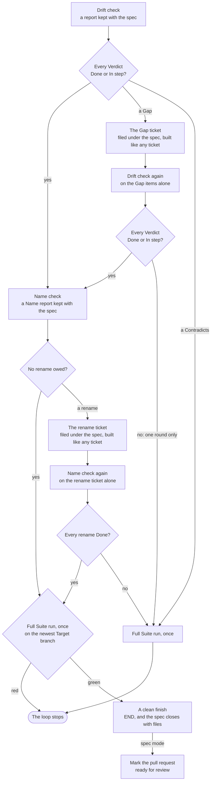

# The full run

Part of [the Dev loop](../the-loop.md).

A Proof knows only the files in your repo. A change outside it, such as a new SDK, can leave a Proof
stale. So after each loop run that landed at least one ticket, the script runs the whole Suite once
more, on the newest Target branch on `origin`, in a worktree of its own.

It runs once, at the end, after the drift check, its count and [the Name check](name-check.md).
When the count finds a Gap, it runs after [the Gap round](drift-check.md#the-gap-round) too, and when the Name
check finds a rename, after [the Name re-check](name-check.md#the-name-re-check). It is the slowest step, so it
runs only on the finished spec. It runs when the loop stopped early too, whether at a ticket, at the
count or at the Name check, because the tickets that landed are on the Target branch all the same.

The full run trusts no Proof and uses no image, so every check runs on your own machine. A check that
goes red there loses all its Proofs, so a stale Proof cannot skip it again.

A red full run stops the loop, and there is no clean finish. The `RED` line names the red checks
and the tickets that landed in the run. The spec stays open, and no Session is asked to fix it: a red
Target branch is yours to decide on. [The Suite](../suite.md) says more.

Each full run writes its output to a file of its own, such as
`.spec-loop/<spec>/full-run-<stamp>.out`, so a later loop on the same spec never empties it. A check
that flakes in the full run gets a `FLAKE` line, and its red output is kept in
`.spec-loop/<spec>/flake-full-run-<stamp>.out`. A full run with a red or a Flake leaves its worktree
in place, and the log names its path. The next full run of the spec removes that worktree before it
opens its own. A left worktree that will not go stops the run, and the `FAIL` line names its path.

## A clean finish

The script decides a clean finish, and nothing else does. A clean finish is every Verdict Done or In
step, no rename owed in [the Name report](name-check.md) or every rename Done in [the Name
re-check](name-check.md#the-name-re-check), and [the full run](#the-full-run) green. Only then does the script write
its `END` line, and with the files Tracker only then does it close the spec. A Gap left after the
round, a Contradicts, a rename not made or a red full run stops the loop before either.
`/skillworks:spec-loop` reads the `END` line and does not judge the report itself, so the skill and
the script never disagree. Before it offers to close the spec, it names each Unrequested item from
the `NOTE` lines.

Closing the spec is where a person says the work is done. With a branch name, a person closes it by
hand after a clean finish. With `spec`, the loop marks the spec's pull request ready for review, and
the spec closes when a person merges it. With the files Tracker, the loop closes the spec itself on a
clean finish, and with `spec` it leaves the pull request to you.
