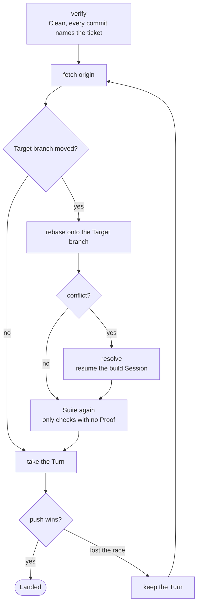

# Rebasing and Landing

Part of [the Dev loop](../the-loop.md).

A ticket Lands the moment it passes, on its own. So a stopped run leaves every ticket before it
already on the Target branch.



1. **Verify.** The worktree is Clean, and every commit carries a `Ticket:` trailer, so it can be
   traced back. With `github` it says `Ticket: #<n>`. With `files` it names the spec and the ticket,
   such as `Ticket: 7/2`.
2. **Fetch** `origin`.
3. **Rebase** onto the newest Target branch, only when it moved. Then the script checks that no commit
   and no file was lost. A file is lost only when the ticket's commits no longer change it, the new
   base does not hold its change, and git finds no path that it moved to. For a file that a
   resolution moved, the landing writes a `note` line that names the old path and the new path. A
   stop for a lost file names the commit the worktree holds now and the commit from before the
   rebase, and gives a `git diff` of the two that changes nothing. It gives no reset. Git leaves a
   commit out when the new base already holds its whole change. Such a commit stops the landing too,
   and the message says that nothing was lost. A person decides what happens to the ticket.
4. **Resolve**, only when the rebase conflicts. The build Session is resumed to fix it. It is told
   that it wrote one side and the other side is a stranger's, so it argues for the other side before
   it drops a line of it. It gets the commits that landed meanwhile, and the ticket behind each one.
   The Session refuses in two cases, and the stop in the log names the rule. Rule 1: the answer is on
   neither side and in neither ticket. Rule 2: its checks still fail after one try at a fix. A refusal
   stops the landing with the rebase open in the worktree. Under rule 2 the files hold the Session's
   resolution, staged or not.
5. **The Suite again**, on the new base. Only the checks with no Proof for the rebased files run, so
   most landings run nothing. An unmoved base skips this, because the `suite` step already answers
   for it.
6. **Push** to the Target branch.

Nothing is pushed unless every step passes.

## The push race and the Turn

Two loops in one clone can finish at the same time. Both push, and one loses: its push is turned down
because the Target branch moved. That is a lost push race, and it is expected.

The **Turn** is the right to push, held by one loop at a time in one clone. A loop takes the Turn only
for its push. A loop that lost a race takes the Turn and keeps it from its next fetch until it Lands,
so the loops beside it cannot beat it again. It goes back to fetch, rebases, runs the Suite, and
pushes again, with no cap on tries.

A loop that waits says so in the log, and names who holds the Turn:

```
note  #203 waits for the Turn, which spec #200 ticket #199 holds
```

The Turn orders the loops of one clone only. A push from another machine can still win, and the loop
tries again. Any push failure that is not a lost race stops the landing with git's message.
