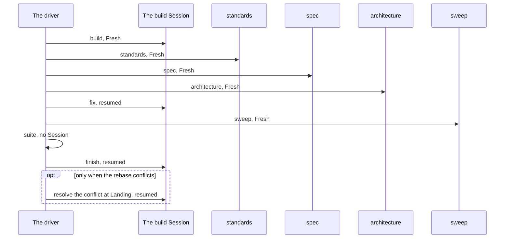

# Sessions

Part of [the Dev loop](../the-loop.md).

The driver starts each Session with `claude -p`. Some start Fresh, with nothing in their context but
what they load and what their prompt says. Some resume the build Session, and carry on with all it
already read and did. This page says which is which, and why a decision has to be in your repo and
not in a Session.

## Every call in a run

A Fresh call is `claude -p "<prompt>" --session-id <new id>`. A resumed call is
`claude -p "<prompt>" --resume <build session>`.

| Call | Session | Shape | Why |
|---|---|---|---|
| The Cut | Fresh | `--session-id <new id>` | It makes the tickets from the spec, and needs nothing but the spec. |
| `build` | Fresh | `--session-id <new id>` | A ticket is sized for one Fresh Session, which starts in the Smart zone. |
| `standards` | Fresh | `--session-id <new id>` | A review that resumed the build Session would mark its own work. |
| `spec` | Fresh | `--session-id <new id>` | A review that resumed the build Session would mark its own work. |
| `architecture` | Fresh | `--session-id <new id>` | A review that resumed the build Session would mark its own work. |
| `fix` | Resumed | `--resume <build session>` | It acts on the code that the build Session wrote. |
| `sweep` | Fresh | `--session-id <new id>` | A resumed step would read the one before it. |
| `suite` | No Session | none | The driver runs the Suite itself. |
| `finish` | Resumed | `--resume <build session>` | It commits and closes the work that the build Session did. |
| The resolve of a conflict at Landing | Resumed | `--resume <build session>` | The build Session wrote one side of the conflict. |
| The drift check | Fresh, in a worktree of its own | `--session-id <new id>` | A judge with no memory of the build judges the work and not the intent. |
| The drift re-check | Fresh, in a worktree of its own | `--session-id <new id>` | A judge with no memory of the build judges the work and not the intent. |
| The Name check | Fresh, in a worktree of its own | `--session-id <new id>` | A judge with no memory of the build judges the work and not the intent. |
| The Name re-check | Fresh, in a worktree of its own | `--session-id <new id>` | A judge with no memory of the build judges the work and not the intent. |
| The full run | No Session | none | The driver runs the whole Suite itself. |

## The cases the table does not hold

- **A Nudge** resumes the Session that the step's own result names, so it carries on with what it
  knows. A step gets two at most. Only a step of a ticket gets one.
- **The round of a red Suite** runs `fix`, `sweep` and `suite` once more. `fix` resumes the build
  Session again, and `sweep` is Fresh again.
- **A restart after [a Keep](stops.md#restarting-a-stopped-run-the-keep)** starts the ticket again
  with a Fresh build Session. The Session of the first try is not resumed.
- **[The Gap ticket](drift-check.md#the-gap-round) and
  [the rename ticket](name-check.md#the-rename-ticket)** are built like any ticket, so each gets a
  build Session of its own.
- **[The grill](the-grill.md#the-grill)** is your own Session, with you in it, and the spec is
  written in that same Session. No Session after it can read it.

## What a Fresh Session starts with

| It starts with | What that is |
|---|---|
| Its prompt | The step's command and the ticket's number. |
| `CLAUDE.md` | With the rules it imports. |
| What the step's skill reads | On demand, as [the stage map](stage-map.md) shows. |
| The ticket and the spec | On the Tracker. |
| The repo | As its worktree holds it. |

## What carries from one Session to the next

| What carries | How |
|---|---|
| The change in the worktree | The next Session opens the same worktree. |
| The three reports, and each Edit | The driver puts them in the `fix` prompt. |
| The commits | They sit on the Job branch. |
| The Closing note | It is on the ticket when the ticket closes. |
| What is pushed to the repo | Such as the glossary and the ADRs. |

Nothing else carries. That is why a grill pushes each word and ADR the moment it settles: a
decision that stays in the grill's Session is lost to every Session after it.

`spec-loop <spec> --dry-run` prints each call with its `--session-id <new id>` or its
`--resume <build session>`, so you can check this page against your own run.
