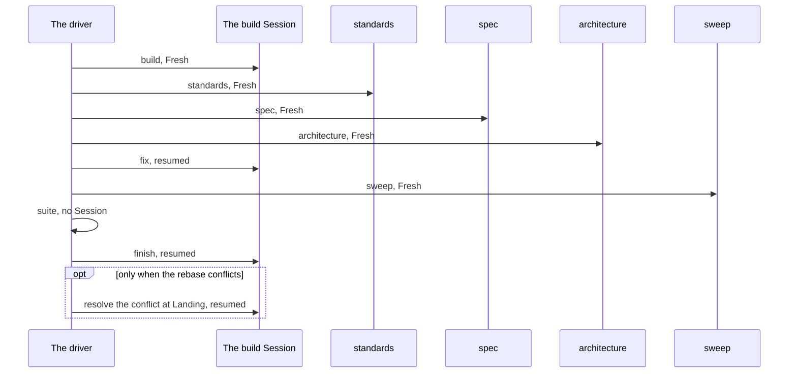

# Sessions

Part of [the Dev loop](../the-loop.md).

The driver starts each Session with `claude -p`. Some start Fresh, with nothing in their context but
what they load and what their prompt says. Some resume the build Session, and carry on with all it
already read and did. This page says which is which, and why a decision has to be in your repo and
not in a Session.

## Every call in a run

A Fresh call is `claude -p "<prompt>" --session-id <new id>`. A resumed call is
`claude -p "<prompt>" --resume <build session>`.

| Call | Session | Shape | Why |
|---|---|---|---|
| The Cut | Fresh | `--session-id <new id>` | It makes the tickets from the spec, and needs nothing but the spec. |
| `build` | Fresh | `--session-id <new id>` | A ticket is sized for one Fresh Session, which starts in the Smart zone. |
| `standards` | Fresh | `--session-id <new id>` | A review that resumed the build Session would mark its own work. |
| `spec` | Fresh | `--session-id <new id>` | A review that resumed the build Session would mark its own work. |
| `architecture` | Fresh | `--session-id <new id>` | A review that resumed the build Session would mark its own work. |
| `fix` | Resumed | `--resume <build session>` | It acts on the code that the build Session wrote. |
| `sweep` | Fresh | `--session-id <new id>` | A resumed step would read the one before it. |
| `suite` | No Session | none | The driver runs the Suite itself. |
| `finish` | Resumed | `--resume <build session>` | It commits and closes the work that the build Session did. |
| The resolve of a conflict at Landing | Resumed | `--resume <build session>` | The build Session wrote one side of the conflict. |
| The drift check | Fresh, in a worktree of its own | `--session-id <new id>` | A judge with no memory of the build judges the work and not the intent. |
| The drift re-check | Fresh, in a worktree of its own | `--session-id <new id>` | A judge with no memory of the build judges the work and not the intent. |
| The Name check | Fresh, in a worktree of its own | `--session-id <new id>` | A judge with no memory of the build judges the work and not the intent. |
| The Name re-check | Fresh, in a worktree of its own | `--session-id <new id>` | A judge with no memory of the build judges the work and not the intent. |
| The full run | No Session | none | The driver runs the whole Suite itself. |

## The cases the table does not hold

- **A Nudge** resumes the Session that the step's own result names, so it carries on with what it
  knows. A step gets two at most. A step of a ticket gets one, and so does the Cut when it filed no
  ticket. The Cut's Nudge resumes the Cut's Session in the Cut's own worktree. The drift check and
  the Name check are Nudged before they stop the loop, when they recorded no report, and so are
  their re-checks, when they recorded no new report. Each one resumes the check's Session in its own
  worktree.
- **The round of a red Suite** runs `fix`, `sweep` and `suite` once more. `fix` resumes the build
  Session again, and `sweep` is Fresh again.
- **A restart after [a Keep](stops.md#restarting-a-stopped-run-the-keep)** starts the ticket again
  with a Fresh build Session. The Session of the first try is not resumed.
- **[The Gap ticket](drift-check.md#the-gap-round) and
  [the rename ticket](name-check.md#the-rename-ticket)** are built like any ticket, so each gets a
  build Session of its own.
- **[The grill](the-grill.md#the-grill)** is your own Session, with you in it, and the spec is
  written in that same Session. No Session after it can read it.

## Nobody answers in the loop

A loop Session never waits for a person. The driver adds words after the command of every Session
it starts. Each kind of step gets its own words, and every set says that nobody will answer a
question.

| Kind of step | The steps | What the words let it write |
|---|---|---|
| A step that builds | The build, `fix` and the Cut | `CHOSE`, `DEPARTS` and `HAND CHECK` |
| A step that judges | The three reviews, `sweep`, the drift check and the Name check | None of the three |
| Finishing | `finish` | `DEPARTS` only |

Only a step that builds makes a Choice or names a Hand check. A review that finds the change differs
from the ticket or the spec reports a finding. A check gives a Verdict. Neither makes a Choice.

The lines a Session can write:

- **A Choice.** A Choice is only for what the ticket and the spec leave open. A point either of them
  names is not open, and a part that only touches the point does not open it. Where they leave more
  than one way open, the Session takes one way, carries on, and writes a line that starts with
  `CHOSE`, with what it chose and why.
- **A question in the ticket.** A question the ticket tells the Session to ask a person is a Choice.
  The build answers it and writes a `CHOSE` line. The question never keeps the ticket open:
  Finishing closes it, and puts the question and the build's answer in the Closing note. You can
  change the answer later from the ticket.
- **A Departure.** Where two parts that both name one point disagree, the build takes the stricter
  one, carries on, and writes a line that starts with `DEPARTS`, naming both parts and why.
  Finishing writes the same line for a fault it may not fix. The loop goes on after a `DEPARTS`
  line, and the list at the end of the run shows every Departure first.
- **A Hand check.** A Hand check needs one of three things no Session has: a real device, such as a
  printer or a phone; a real outside account or service; or a person's eyes on the screen or the
  page. Nothing else is one. The Suite is never one, because the driver runs it. A question to a
  person is never one, because it is a Choice. The Session carries on, and writes a line that starts
  with `HAND CHECK`, with the check and how a person runs it.
- **Blocked.** Only where the Session cannot do the work, it begins its report with a line that
  starts with `BLOCKED`: a tool call was denied and no allowed way exists, or the ticket has nothing
  left to build. A choice is never Blocked. The driver then stops the loop at that step, with no
  Nudge, as [When a step fails](stops.md) shows.

The driver copies each of these lines into the log, and lists them all again when the run ends, as
[Reading a run](reading-a-run.md) shows. `spec-loop <spec> --dry-run` prints each set of words
beside the steps that get it.

The words are the driver's and sit in no skill. A skill you run by hand still asks you, because you
are there to answer.

## What a Fresh Session starts with

| It starts with | What that is |
|---|---|
| Its prompt | The step's command and the ticket's number, then the words for its kind of step, which say nobody will answer. |
| `CLAUDE.md` | With the rules it imports. |
| What the step's skill reads | On demand, as [the stage map](stage-map.md) shows. |
| The ticket and the spec | On the Tracker. |
| The repo | As its worktree holds it. |

## What carries from one Session to the next

| What carries | How |
|---|---|
| The change in the worktree | The next Session opens the same worktree. |
| The three reports, and each Edit | The driver puts them in the `fix` prompt. |
| The commits | They sit on the Job branch. |
| The Closing note | It is on the ticket when the ticket closes. |
| What is pushed to the repo | Such as the glossary and the ADRs. |

Nothing else carries. That is why a grill pushes each word and ADR the moment it settles: a
decision that stays in the grill's Session is lost to every Session after it.

`spec-loop <spec> --dry-run` prints each call with its `--session-id <new id>` or its
`--resume <build session>`, so you can check this page against your own run.
