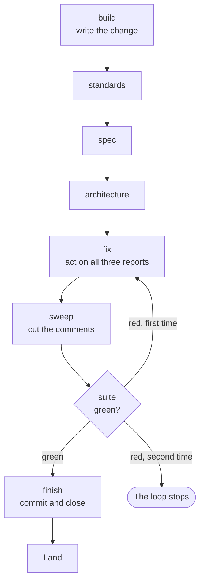

# The steps of one ticket

Part of [the Dev loop](../the-loop.md).

<!-- steps -->
build → standards → spec → architecture → fix → sweep → suite → finish

Every step but `suite` is a Session of its own, run inside the ticket's worktree.

| Step | What it does |
|---|---|
| `build` | Builds the change test-first, and leaves it uncommitted. |
| `standards` | Reviews the change against your rules, and fixes what it finds. |
| `spec` | Reviews the change against the ticket and the spec, and each Surface the spec names for the ticket, and fixes what it finds. |
| `architecture` | Reviews where the change sits and which way it points, and fixes what it finds. |
| `fix` | Reads all three reports at once, settles any disagreement, and fixes what is left. |
| `sweep` | Cuts the comments back to what your rules keep. |
| `suite` | The script runs your Suite. No Session is asked. |
| `finish` | Commits the change, and closes the ticket. The Plugin's hook adds the `Ticket` trailer to every commit a loop Session makes. It never pushes. |

The three reviews start Fresh. A review that resumed the build Session would mark its own work. `fix`
and `finish` resume the build Session, because they act on the code it wrote.

With a README Surface, `spec` removes any README edit the README item does not ask for. An edit
stays only when the spec's README item asks it of this ticket, or the ticket itself asks for it, as
a Gap ticket and a rename ticket do. So a build cannot add to the README on its own. With no README
Surface, the README is any other file.

`sweep` comes after `fix`, because every step that writes could put back a comment the sweep cut.

The script reads a fact after each step, because a Session can end cleanly and still do nothing. It
reads the step's result, git and the ticket's state. For example, `build` must leave the worktree
changed, and `finish` must leave a new commit whose `Ticket` trailer git reads, a Clean worktree and a
closed ticket. The hook adds that trailer to every commit a loop Session makes, so the check is a net
for a commit the hook never saw.

**An Edit.** A review can change the code. So the script reads the worktree before and after each
review, and the difference is that review's Edit. It goes to the log as an `EDIT` line and into the
`fix` prompt beside the report. An Edit never stops the loop. It is only never silent.

**The run by hand.** `/skillworks:implement <n>` with no flag runs the same steps in one Session. Its
review is `/skillworks:review-changes`, which runs each axis in a sub-agent of its own. Each
sub-agent follows the same axis steps as the loop's review step, and only reports. By hand, the
reviews edit nothing, and `implement` fixes what they found. Run `/skillworks:review-changes` on
its own to review a branch against a fixed point. For a check on correctness alone, run Claude
Code's own `/code-review`.

## The Suite

The Suite is the checks your repo names in `docs/agents/suite.json`. The script runs them itself,
reads the exit status, and keeps the output. So the gate that says a ticket is done rests on nothing a
Session said about itself. [The Suite](../suite.md) has the whole file.

Each time a check passes, the Suite keeps a **Proof**: the check, and the exact inputs it passed on.
A check's inputs are every file in the worktree that git does not ignore, less the paths the check
lists under `ignores`. A check whose inputs match a Proof does not run. Its line in the Suite output
says so and names the Proof, so a ticket's record shows what an earlier run proved as well as what
this one did.

Proofs stay in your clone, and every worktree and every loop in it shares them. So a Session that
runs `skillworks-suite` while it builds keeps Proofs the `suite` step reads, and the ticket does not
pay for the same checks twice.

First the script proves the machine can run the checks that will run. Each `ready` command runs, one
by one. A machine that is not ready is not a red Suite: the loop stops and names what is missing.
Then the checks run together, so the Suite takes as long as its slowest check.

**A red Suite goes round once.** Red on every one of its `runs` belongs to the ticket. The script puts
the failing output into the `fix` prompt, then runs `sweep`, then the Suite again. Green carries on to
`finish`. Red a second time stops the loop. There is never a second round. The checks that passed
before the fix keep their Proofs, so the second Suite runs only the red checks and the checks whose
inputs the fix changed.

**A Flake is green, and never silent.** A check that goes red and then passes on a later run of the
same Suite is a Flake. The `suite` step counts it as passed and goes on to `finish`, with no `fix`.
The log gets a `FLAKE` line naming the check, and its red output is kept in a file of its own under
`.spec-loop/<spec>/`, such as `.spec-loop/<spec>/flake-ticket-<n>-suite-<stamp>.out`. The stamp is the
time to the microsecond, so no later run writes over it. A Flake in the Suite a landing runs gets the
same line and a file named for `land`. The `finish` Session is handed each Flake and its kept file,
and names both in the ticket's Closing note. The ticket's worktree goes when it lands, Flake or not.

**The spec gets a note of the run's Flakes.** When the loop ends, whether the spec completes or the
run stops, the script adds one note to the spec under the heading `## Flakes`. It lists each Flake of
the run: the check, the step it came in, such as `#202 suite` or `the full run`, and the file that
keeps its red output. When [the full run](../the-loop.md#the-full-run) left its worktree in place, the note names
that path too, so a crash dump is found without a search. A run with no Flake adds no note. The note
goes the way the drift report goes. With the GitHub Tracker it is a new comment on the spec issue.
With the files Tracker it is a section of `spec.md`, above the drift report, and a later run's note
takes its place. The log gets a `NOTE` line when the note is recorded. A note the Tracker turns down
gets a `WARN` line and ends nothing, because the `FLAKE` lines already name each Flake.
