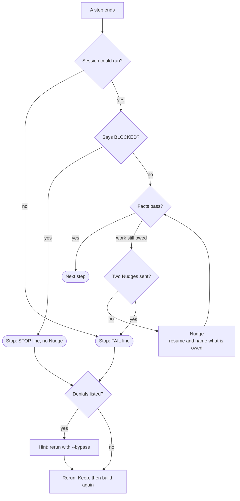

# When a step fails

Part of [the Dev loop](../the-loop.md).



**A Nudge.** A Session can stop before its work is done: no report written, nothing committed, the
ticket still open. The script then resumes that same Session and names what is still owed, so it
carries on with what it knows. The Nudge also says that nobody will answer a question. A Session that
put a choice to a person makes that Choice itself, within what its step allows, and writes a `CHOSE`
line. Two Nudges are the limit. A step that still owes work after them stops the loop. A Session that
could not run at all, such as one that ended in an error or never loaded its command, gets no Nudge.
It stops the loop at once.

**A Nudge for the Cut.** The Cut is Nudged too, when the Tracker holds no ticket after it. Its Nudge
names what is missing and the command that records it, then ends as every Nudge does. Each Nudge
writes a `NUDGE` line. A Cut that still filed nothing after two Nudges stops the loop with a `STOP`
line, as [the tickets](tickets.md) says.

**A Blocked step.** A Session that cannot do its work begins its report with a line that starts
with `BLOCKED`, as [Sessions](sessions.md#nobody-answers-in-the-loop) says. The script reads only the
first line of the report that is not empty, so a `BLOCKED` lower down does not count. It reads it
after the facts that show the Session could run, and before the facts that show the work was done. A
Blocked step stops the loop at once, at that step, even when every fact passes. A Blocked build stops
the loop before the reviews run. No Nudge is sent, and a Blocked answer to a Nudge gets no second
Nudge. The script reopens the ticket if it is closed. The `STOP` line names the ticket, the step and
the Session's own line, then lists the Denials of that result and the hint, as below:

```
STOP  #203 step build is Blocked: BLOCKED .claude/settings.json: the write was refused as a sensitive file.
      Its worktree is at .claude/worktrees/spec-200/ticket-203. See ...
```

A Blocked Cut, drift check or Name check stops the loop the same way, and its `STOP` line names the
check.

**A stop.** Every other failure stops the run where it stands. The one rescue is the round a red Suite
goes, in [the Suite](steps.md#the-suite). The script reopens the ticket, because `finish` may have closed it before its work
reached the Target branch, and the loop only picks open tickets. If this run landed a ticket before
the stop, [the full run](full-run.md) runs next. The `FAIL` line in the log names the worktree and the files to read:

```
FAIL  #203 step fix failed check ticket-open. Its worktree is at .claude/worktrees/spec-200/ticket-203. See ...
```

**A spec in another shape.** Before any ticket, the script reads the spec's [counted
shape](the-grill.md#the-spec). A spec it cannot count stops the loop there, before a
ticket is claimed or a Session started. The `ABORT` line names each fault. Fix the spec on the
Tracker and run the loop again:

```
ABORT spec #200 is not in the shape the loop counts, so no ticket was started.
      Fault: ## User Stories skips 3: it goes from 2 to 4
      Fault: a Surface item under ## Surfaces opens with no bold name: - The README: says so.
      /skillworks:grill writes a spec in the shape the loop counts. Write it in that shape, and run the loop again.
```

**A rule with no import.** Before any ticket, and before a dry run prints its plan, the script checks
that `CLAUDE.md` imports each rule in `docs/agents/rules/`. It reads both from the repo's top level.
A rule with no import would not load into any step, so the loop stops. The `ABORT` line names the
rule and the line to add. It is the same check, and the same words, as setup's preflight:

```
ABORT docs/agents/rules/words.md has no import in CLAUDE.md, so it does not load into a session. Add this line to CLAUDE.md: @docs/agents/rules/words.md
```

**A missing Steering file.** Before any ticket, and before a dry run prints its plan, the script checks
that each file setup seeds is in the repo. It reads the same list of files that setup writes from, so
a Seed that a newer Plugin adds is checked too. A step that needs a missing file would stop in the
middle of a ticket, so the loop stops first. The `ABORT` line names the file and says to run setup,
which writes the file again:

```
ABORT docs/agents/review-standards.md is missing, and setup seeds it. Run /skillworks:skillworks-setup to write it again.
```

**A spec with no commit to read.** Before the drift check, the drift re-check and the Name check, the
script looks up the spec's commits the way `spec-commits` does. Every Landed ticket's commit names its
ticket in a `Ticket:` trailer, so a spec with no such commit after the base commit means the lookup
broke. The loop stops with a `STOP` line and runs no check, so a broken lookup never reads as a clean
report. The spec stays open, and the full run still runs first:

```
STOP  spec #200 has no commit after the base commit 7c41e0a9d2f3b8c56e1a4d7f09b2c3e8a5d6f1b4 whose Ticket: trailer names one of its tickets. Every Landed ticket's commit names it, so the lookup broke. The drift check did not run and the spec stays open.
```

Check that `git log` on the Target branch shows each Landed ticket's `Ticket:` trailer, and run the
loop again.

**A drift report that leaves work owed.** After the last ticket, the script [counts the drift
check's Verdicts](drift-check.md#the-count). No report, a report with no `### Verdicts` list, or a Contradicts
stops the loop with a `STOP` line, and the spec stays open. A Gap does not stop it at once: the loop
builds its Gaps in [one round](drift-check.md#the-gap-round). A Gap still left after that round stops the loop.
Every ticket has landed by then, so there is nothing to Keep, and the full run still runs before the
loop ends. The line names each Gap left:

```
STOP  the drift check still finds 2 Gaps on spec #200 after the Gap ticket was built, and the loop goes round once. A person decides.
      Gap: S4 is Missing: No code writes the NOTE lines.
      Gap: The user docs has no Verdict
      Read it at .spec-loop/200/drift-gaps.md
```

The loop built these once and they are still owed, so a second build would most likely miss again.
Read the report, build what is owed in a ticket of its own or change the spec, and run the loop again.

**A Name report the loop cannot read.** After the drift check, the script runs [the Name
check](name-check.md). No Name report, or a report with no `### Renames` list, stops the loop with
a `STOP` line, and the spec stays open. A rename does not stop it: the loop builds it in [the rename
ticket](name-check.md#the-rename-ticket).

**A rename not made.** After the rename ticket Lands, [the Name re-check](name-check.md#the-name-re-check) gives
each rename Done or Not done. A rename Not done, one with no Verdict, or one with two stops the loop.
So does a Name re-check that recorded no new report, or one with no `### Verdicts` list. The full
run still runs first. The line names each rename not made:

```
STOP  the Name re-check finds 1 rename not made on spec #200 after the rename ticket was built. A person decides.
      Not made: Batch is Not done: Batch is still the name in two files.
      Read it at .spec-loop/200/names-renames.md
```

The loop built the rename once and it is still owed. Make it in a ticket of your own, and run the loop
again.

## Restarting a stopped run: the Keep

To restart, run the same command again: `spec-loop <spec>`.

It first does a **Keep** on the worktrees the stopped run left behind. For each one, it commits any
uncommitted work to the Job branch, removes the worktree, and renames the Job branch out of the way,
to `spec-loop/<spec>/ticket-<n>-kept-1`. A Keep discards nothing. The log says what it kept:

```
KEPT  ticket-203 held uncommitted work. The whole attempt is on branch spec-loop/200/ticket-203-kept-1
```

**Held** means the worktree had uncommitted work, and the Keep committed it. **Clean** means it had
none. Either way, the attempt is on that branch if you want to read it.

Then the run starts the first open ticket again from the Target branch, with a Fresh build Session.

## A Denial, and `--bypass`

A **Denial** is a tool call Claude Code turned down because the Session had no permission for it: a
write to a protected path, or a command no allow rule names. A Session with nobody watching cannot ask
you, so a Denial is final. A write under `.claude/` is always turned down in the default mode, whatever
your allow rules say.

Many Denials are worked around. When a step stops and its result lists Denials, the `FAIL` line names
each one and adds a hint. So does the `STOP` line of a Blocked step, of a Cut that filed no tickets,
and of a check that recorded no report:

```
      Denial: Write {"file_path": ".claude/settings.json", ...
      If one of these Denials stopped the loop, rerun with spec-loop 200 --bypass
```

The default mode is `acceptEdits`. `spec-loop <spec> --bypass` runs every Session of the run in
`bypassPermissions`, the landing too. Use it only when a Denial stopped the loop. A stop with no
Denials gives no hint, because its cause lies somewhere else. The `LOOP` line at the top of the log
names the mode the run is in.

The drift check and the Name check read the spec's commits through `spec-commits`, and record their
reports through `tracker-publish`. With no `Bash(spec-commits:*)` or no `Bash(tracker-publish:*)`
rule in your allowlist, that command is a Denial, and the loop stops at the check. Its `STOP` line
names the Denial, and a rerun with `--bypass` gets that one run past it. Add the rules with
`allow-commands` too, because every run after it in the default mode meets the same Denial.
